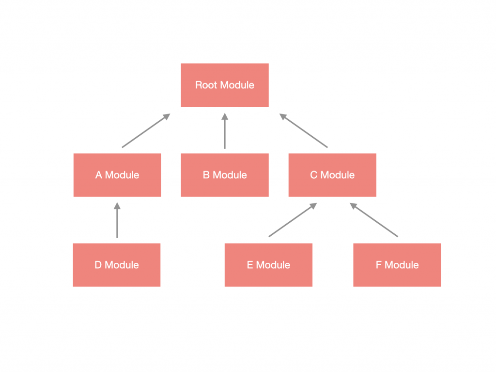
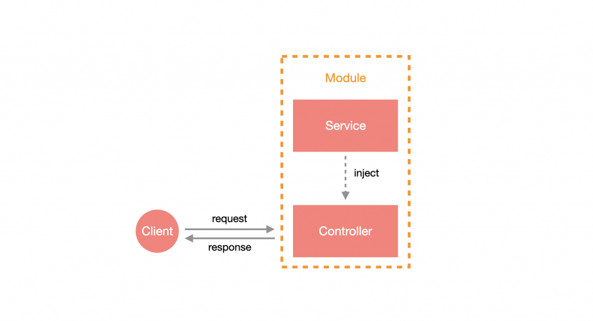
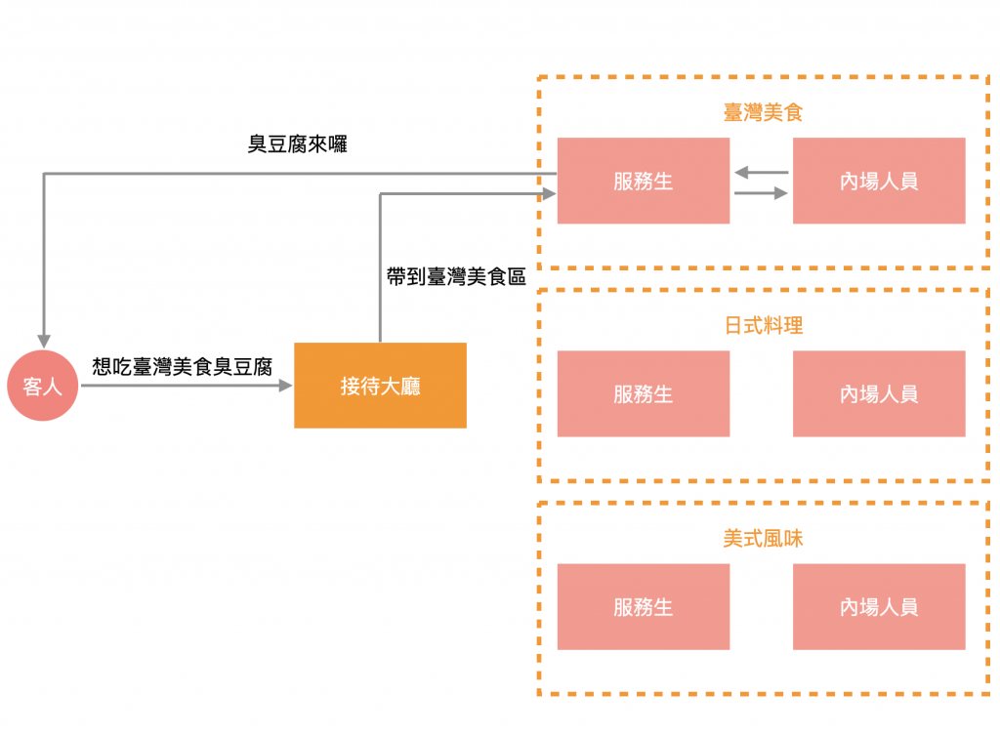

# Nest 基本概念

Nest 采用 **模块化** 设计，将各个不同的功能打包成 **模块 (Module)**，而模块至少有 一个以上，并且是以 **树状结果** 发散出去，最顶部的模块称为 **根模块(Root Module)**，其概念如下：



而一个 **有路由机制** 的模块会带有 **控制器 (Controller)** 与 **服务 (Service)**，它们之间的关係如下：



从图中可以看出 `Controller` 与 `Service` 通过 `Module` 建立关系后，即可将 `Service` 注入 (`Inject`) 到 `Controller` 中使用，这样的好处是可以职责分离，把处理请求的操作交给 `Controller`，把处理逻辑的部分交给 `Service`，这样说明有点太抽象了，那来点实际流程吧：

1. 客户端向 `Nest App` 发出 `Http` 请求。
2. 由 `Controller` 接收请求。
3. 通过注入 `Service` 来调用里面的方法，进而处理背后的逻辑。
4. 由 `Service` 返回值，`Controller` 将结果响应给客户端。

用现实生活中的例子来说明 `Nest` 整体概念的话，`Nest App` 就像一间有多国料理的餐厅，该餐厅规划每种国家的料理即一个区块，每个区块都有负责的外场服务生，而这个区块即为 `Module`，`Controller` 就是外场服务生，而 `Service` 则是内场人员，当客人走进餐厅时，先依照想吃的异国料理来安排座位，外场服务生协助客人点餐并将订单送至内场，内场人员开始针对客人的订单做料理，当餐点做好了之后，再请外场服务生送到客人面前：



现在对于 Nest 应该有些概念了，那就来看如何创建第一个 Nest App 吧！

# CLI

Nest 官方设计了一套 CLI 来帮助各位开发者们加速开发，要使用 Nest CLI 构建项目，请运行以下命令。这将创建一个新的项目目录，并生成 Nest 核心文件和支持模块，为您的项目创建传统的基础结构。

```shell
$ npm install -g @nestjs/cli
$ nest new <APP_NAME>
```

> **！Tips**：你可以通过 `nest --help` 查看有关 Nest 的命令行操作，我认为只是有必要的，了解常用的指令操作可提高你创建对应模块的效率。

基于 CLI 新建项目之后，将会创建 `<APP_NAME>` 目录， 并生成相应的配套文件，核心文件：

- 入口文件：`main.ts`

- 根模块：

  - `app.controller.ts`：控制器（负责路由/参数）

  - `app.module.ts`：根模块
  - `app.service.ts`：服务（提供者）（负责业务逻辑）- 非必须

> **！Tips**：以`spec.ts` 结尾的文件为测试文件，可直接删除，本系列教程不会设计 `spec.ts` 的应用。

`main.ts` 包含一个异步函数，它负责 **引导** 我们的应用程序：

```typescript
import { NestFactory } from '@nestjs/core';
import { AppModule } from './app.module';

async function bootstrap() {
  const app = await NestFactory.create(AppModule);
  await app.listen(3000);
}
bootstrap();
```

以 `bootstrap` 作为载入函数，通过 `NestFactory.create(AppModule)` 产生一个 Nest App 的实例 (`Instance`)，并通过监听(`listen`) 3000 端口将程序跑起来。

现在我们执行指令，启动项目：

```shell
$ npm run start:dev
```

然后在浏览器输入：http://localhost:3000/

此时界面出现：`Hello World!`

# 目录结构

目录结构：[最佳目录实践 >>](https://www.toimc.com/nestjs-example-project-4/#%E6%9C%80%E4%BD%B3%E5%AE%9E%E8%B7%B5) / [基础目录结构 >>](https://juejin.cn/post/6844904192687996936)

```
nodejs
├── node_modules
├── src
│   ├── auth
│   │   ├── dto
│   │   ├── strategies （策略）
│   │   └── ...
│   ├── common （通用模块）
│   │   ├── constants （全局常量定义）
│   │   └── interfaces （全局类型声明）
│   ├── configs （配置文件信息）
│   ├── core （核心模块 - 主要放置和Nest直接相关的模块，如 守卫、过滤器等...）
│   │   ├── decorators（装饰器）
│   │   │   └── public.decorator.ts
│   │   ├── filters（过滤器）
│   │   │   └── global-exceprtion.filter.ts
│   │   ├── guards（守卫）
│   │   │   └── jwt-auth.guard.ts
│   │   ├── interceptors（拦截器）
│   │   │   └── response.interceptor.ts
│   │   ├── middleware（中间件）
│   │   │   └── visitor.middleware.ts
│   │   └── pipes（管道，主要用于数据验证和类型转换）
│   │   │   └── validation.pipe.ts
│   ├── database（数据库相关）
│   ├── shared（业务代码）
│   │   └── users
│   │   │   ├── dto （数据传输对象定义）
│   │   │   │   └── users.create.dto.ts
│   │   │   │   └── users.update.dto.ts
│   │       ├── users.controller.ts （控制层）
│   │       ├── users.module.ts (模块定义）
│   │       └── users.service.ts （service层）
│   ├── swagger（Api接口文档）
│   ├── app.module.ts
│   └── main.ts
├── test （单元测试）
│   ├── app.e2e-spec.ts
├── tsconfig.json
├── ...
```

# 小结

Nest 提供高度的模块化设计，只要把 `Controller` 与 `Service` 定义好并放入对应的 `Module` 里，再像拼拼图一样把相关模块各自关联起来，就可以建立起易维护、低耦合、易扩展的 Node.js 后端应用，如果再使用官方设计的 CLI，将大幅加速开发时间。


