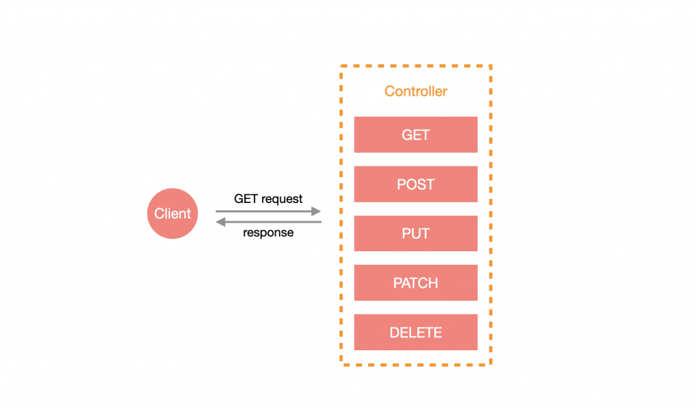
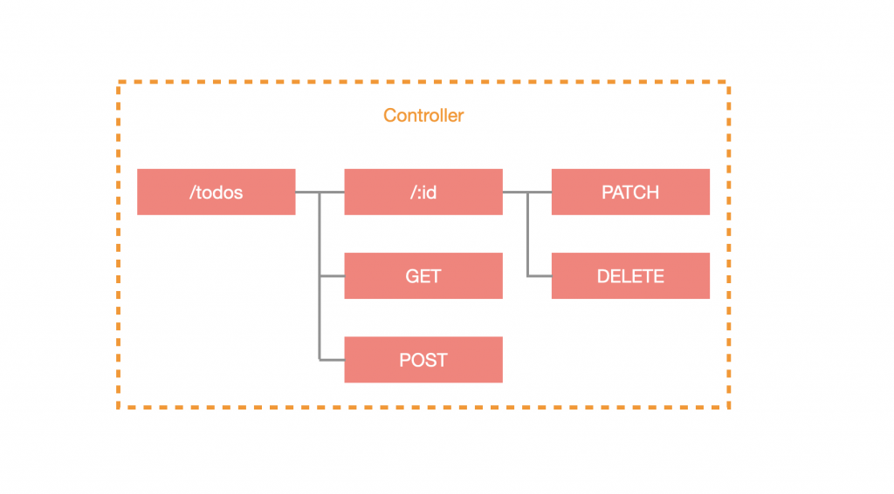
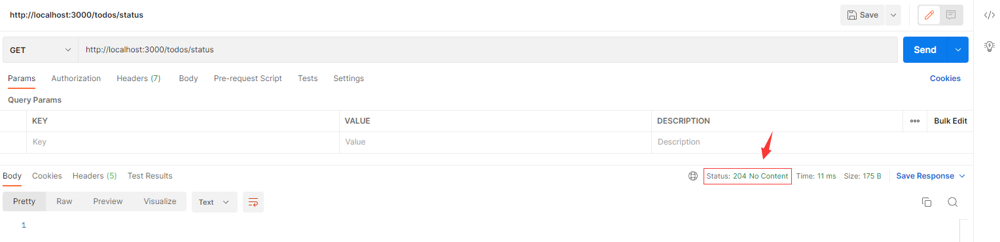
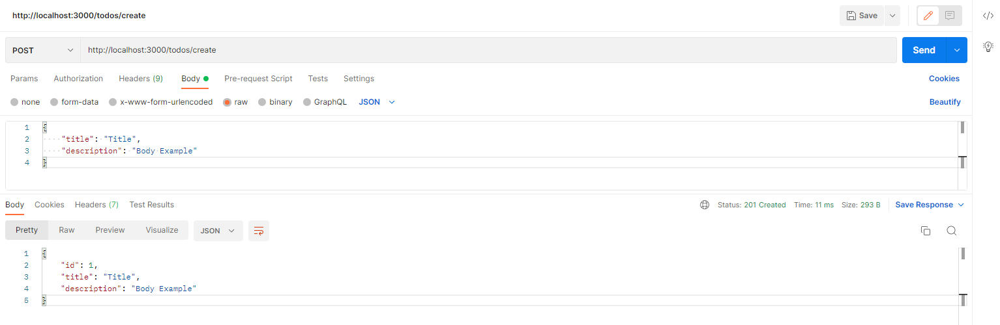
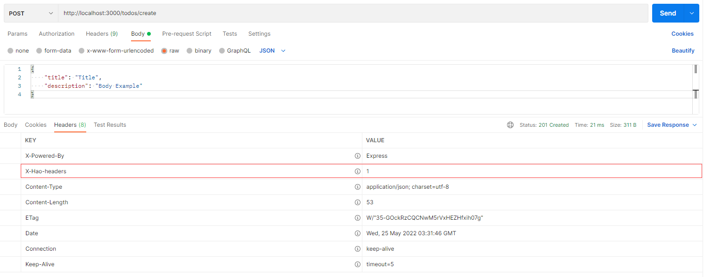

# 概述

控制器负责 **路由的配置** 并 **处理来自客户端的请求**，而每一个控制器都可以依照需求来设计不同 `Http Method` 的资源。



# 创建控制器

所有的控制器都必须使用 `@Controller` 装饰器来定义。可以用 CLI 快速生成控制器：

```shell
$ nest generate controller <CONTROLLER_NAME>
```

> **！注意**：<CONTROLLER_NAME> 可以含有路径，如：`shared/todo`，这样就会在 `src` 目录下建立该路径并含有对应的 `Controller`。

这边我建立了一个名为 `todo` 的 Controller，并将其放在 `src/shared/` 目录下：

```shell
$ nest g co shared/todo
```

当你建立好 `Controller` 之后，会自动在 `app.module.ts` 文件中导入，如下所示：

```typescript
import { Module } from '@nestjs/common';
import { AppController } from './app.controller';
import { AppService } from './app.service';
import { TodoController } from './shared/todo/todo.controller';

@Module({
  imports: [],
  controllers: [AppController, TodoController],
  providers: [AppService],
})
export class AppModule {}
```

# 路由

创建完毕，你会发现 `todo.controller.ts` 的 `@Controller` 多了一个字符串 `todo`，这是路由的 **前缀 (prefix)**：

```typescript
import { Controller } from '@nestjs/common';

@Controller('todos')
export class TodoController {}
```

> **！注意**：通过 CLI 建立的 `Controller` 前缀默认使用该 `Controller` 的名称，通常会习惯把名称取单数，而前缀改为复数，所以这里我加了一个 `s`。

添加路由前缀的好处是可以使相同路由的资源都归纳在同一个 `Controller` 里面，其中包含了前缀底下的所有子路由：



## 请求方法

可以通过添加装饰器在 class 的方法上，来指定不同的请求方法 ，Nest 会根据 Controller 与指定的 请求方法 装饰器来建立路由表。下面的代码以 `GET` 为例：

```typescript
import { Controller, Get } from '@nestjs/common';

@Controller('todos')
export class TodoController {
  @Get()
  getAll() {
    return [];
  }
}
```

使用浏览器输入 http://localhost:3000/todos 查看结果。

Nest 的请求方法装饰器名称对应标准 Http Method，这里做了些归纳：

- `@Get`：表示接收对应路由且为 `GET` 请求时触发。
- `@Post`：表示接收对应路由且为 `POST` 请求时触发。
- `@Put`：表示接收对应路由且为 `PUT` 请求时触发。
- `@Patch`：表示接收对应路由且为 `PATCH` 请求时触发。
- `@Delete`：表示接收对应路由且为 `DELETE` 请求时触发。
- `@Options`：表示接收对应路由且为 `OPTIONS` 请求时触发。
- `@Head`：表示接收对应路由且为 `HEAD` 请求时触发。
- `@All`：示接收对应路由且为以上任何方式的请求时触发。

## 子路由

在设计路由时，通常会有子路由的需求，比如说：在 `/todos` 下我们需要一个获取示例的接口，定义为 `GET /todos/examples`，不可能每次有子路由时都建立一个新的 Controller 吧？，这时候我们就可以通过 请求方法 装饰器来指定子路由啦，子路由会基于 Controller 设置的前缀来建立，以下方代码为例：

```typescript
import { Controller, Get } from '@nestjs/common';

@Controller('todos')
export class TodoController {
  @Get('/examples')
  getExamples() {
    return [
      {
        id: 1,
        title: 'Example 1',
        description: '',
      },
    ];
  }
}
```

使用浏览器输入 http://localhost:3000/todos/examples 查看结果。

## 路由通配符

有时候设计路由时，可能会提供些许的容错空间，比如说：原本是 `GET /todos/examples`，但不管是 `/todos/exammmmmmmmples` 还是 `/todos/exam_ples` 都可以得到 `/todos/examples` 的结果，此时我们就可以使用通配符来定义内容啦，如下所示：

```typescript
import { Controller, Get } from '@nestjs/common';

@Controller('todos')
export class TodoController {
  @Get('/exam*ples')
  getExamples() {
    return [
      {
        id: 1,
        title: 'Example 1',
        description: '',
      },
    ];
  }
}
```

使用浏览器输入 http://localhost:3000/todos/exammmmmmmmples 查看结果。

## 路由参数（Path Parameters）

路由参数的设计十分简单，会在 Http Method 装饰器上做定义，字串格式为 `:<PARAMETER_NAME>`，接着要在该方法中添加带有 `@Param` 装饰器的参数，这样就可以顺利取得路由参数。这里我们新增一个路由参数为 `id` 的路由，代码如下：

```typescript
import { Controller, Get, Param } from '@nestjs/common';

@Controller('todos')
export class TodoController {
  @Get(':id')
  get(@Param() params: { id: string }) {
    const { id } = params;
    return {
      id,
      title: `Title ${id}`,
      description: '',
    };
  }
}
```

这里还有另一种方式可以取得特定路由参数，就是在 `@Param` 带入指定参数名称：

```typescript
@Get(':id')
get(@Param('id') id: string) {
  return {
    id,
    title: `Title ${id}`,
    description: '',
  };
}
```

使用浏览器输入 http://localhost:3000/todos/1 查看结果

## 查询参数（Query Parameters）

查询参数与路由参数取得的方式很相似，但不需要在 Http Method 装饰器中做任何设置，只需要在方法中添加带有 `@Query` 的参数即可。这里我们做一个简单的范例：

```typescript
@Get('list')
getList(@Query() query: { limit: number; skip: number }) {
  const { limit = 30, skip = 0 } = query;
  const list = [
    { id: 1, title: 'Title 1', description: '' },
    { id: 2, title: 'Title 2', description: '' },
  ];
  return list.slice(skip, limit);
}
```

也可以取得特定查询参数，就是在 `@Query` 带入指定参数名称：

```typescript
@Get('list')
getList(
  @Query('limit') limit: number = 30, 
  @Query('skip') skip: number = 0
) {
  const list = [
    { id: 1, title: 'Title 1', description: '' },
    { id: 2, title: 'Title 2', description: '' },
  ];
  return list.slice(skip, limit);
}
```

使用浏览器输入 http://localhost:3000/todos/list?limit=1 查看结果

## 状态码（Http Code）

默认情况下，除了 POST 会回传 201 外，大多数的请求方法都是回传 200，不过应该要以实际情况来回传适当的状态码。Nest 提供了状态码的 enum，并用装饰器来设置回传的状态码，十分贴心！下方为代码示例：

```typescript
@Get('status')
@HttpCode(HttpStatus.NO_CONTENT)
get1() {
  return [];
}
```

这里用 Postman 来查看结果：



# 请求体（负载）

在传输数据的时候经常会用到主体（请求体）传参，比如说：`POST`、`PUT`、`PATCH` 等操作。Nest 有提供 `@Body` 装饰器來取得 `Body` 数据。代码如下：

```typescript
@Post('create')
create(@Body() data: { title: string; description?: string }) {
  return { id: 1, ...data };
}
```

也可以通过指定参数名称来取得特定参数：

```typescript
@Post('create')
create(
  @Body("title") title: string,
  @Body("description") description?: string
) {
  return { id: 1, title, description};
}
```

通过 Postman 来查看结果：



# 使用DTO

什么是 DTO？它的全名是 **数据传输对象** (**D**ata **T**ransfer **O**bject)，其用途广泛，通常用于过滤、格式化数据，它只负责存放要传递的资讯，故 **只有只读属性**，没有任何方法。定义 DTO 之后，就不必一直翻文件查到底参数格式为何，可以很清楚的了解传入 / 传出的参数内容，在 Nest 的世界里，甚至可以基于 DTO 的格式来设置验证器，进而大幅降低维护成本。

既然是定义格式，那么就有两种选择：

- TypeScript 的 `interface`
- 标准 JavaScript 支持的 `class`

基本上会建议大家采用 `class` 的形式来建立 DTO，原因是 `interface` 在编译成 JavaScript 就会被删除，而 `class` 会保留，这对部分功能是有影响的，所以 官方也推荐大家采用 `class`。

接下来，我们新建一个 DTO 示例，在要调整的 Controller 目录下，新增一个名为 dto 的文件夹，并建立 `create-todo.dto.ts`，内容如下：

```typescript
export class CreateTodoDto {
  title: string;
  description?: string;
}
```

创建后，在 Controller 中使用，将带有 `@Body` 装饰器的参数的类型指定为该 DTO：

```typescript
@Post('create')
create(@Body() dto: CreateTodoDto) {
  return { id: 1, ...dto };
}
```

> **！提示**：关于如何通过 dto 做校验，我们会在后续章节提到，这里你可以简单的理解成就是在做一些类型声明。

# Headers

如果你需要自定义头部响应给客户端，可以通过 `@Header` 装饰器来实现：

```typescript
@Post('create')
@Header('X-Hao-headers', '1')
create(@Body() dto: CreateTodoDto) {
  return { id: 1, ...dto };
}
```



# 参数装饰器

前面有提过 Nest 是以 `Express` 或 `Fastify` 作为底层基础进行整合的框架，在很多地方都是对底层平台进行包装的，其中的参数正是包装出来的，通过特定的参数装饰器来取得不同的数据，除了前面提及的几项以外，还有提供许多参数装饰器来提供开发人员取得更多信息：

- `@Reuest()`
- `@Response()`
- `@Next()`
- `@Param(key?: string)`
- `@Query(key?: string)`
- `@Body(key?: string)`
- `@Headers(name?: string)`
- `@Ip()`
- `@HostParam()`

# 处理响应

通过 `return` 数据的方式让 Nest 来处理回应的动作，也是 **官方最推荐** 的方式。示例代码如下：

```typescript
@Get('all')
getAll() {
  return [];
}
```

上述示例中，当客户端调用 http://localhost/todos/all 接口时，后端将响应 `[]`。

## 异步

在后端领域中，几乎都会使用到异步操作，这时候用 ES7 的 `async/await` 再好不过，而标准模式也支持此方式：

```typescript
@Get('all')
async getAll() {
  return await new Promise((resolve, reject) =>
    setTimeout(() => resolve([]), 1000),
  );
}
```

# 小结

- Controller 负责路由及处理来自客户端的请求。
- Controller 可以将相同路径下的资源整合在一起，包含子路由。
- 通过 Http Method 装饰器轻松配置对应的资源。
- 通过 `@Param` 取得路由参数、通过 `@Query` 取得查询参数、通过 `Body` 取得 body 参数。
- 通过 `@HttpCode` 与 `HttpStatus` 来配置该资响应的状态码。
- 善用 DTO 来定义数据传输格式。
- 通过 `@Header` 配置响应的标头。

Controller 负责处理客户端的请求，可以把它视为 API 的门面，既然是门面，那么在面对各式各样的请求都要有相对应的应对方式，所以 Controller 的功能这么多合情合理！

还记得前面说过的 Controller 是某个区块的外场服务生吗？目前的示例是将 Controller 直接挂在根模块下，如果所有的 Controller 都挂在根模块的话，会变成所有的外场服务生都属于同一区，并没有做到良好的动态规划，所以应该要将 Controller 放入对应的 Module。下一篇将会介绍 Nest 中的 Module...

