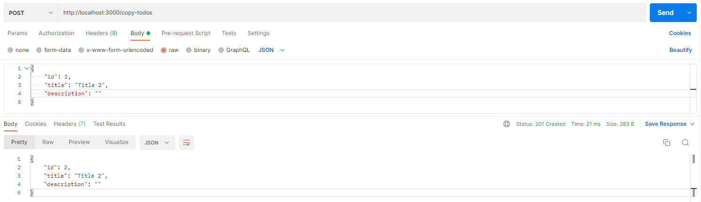
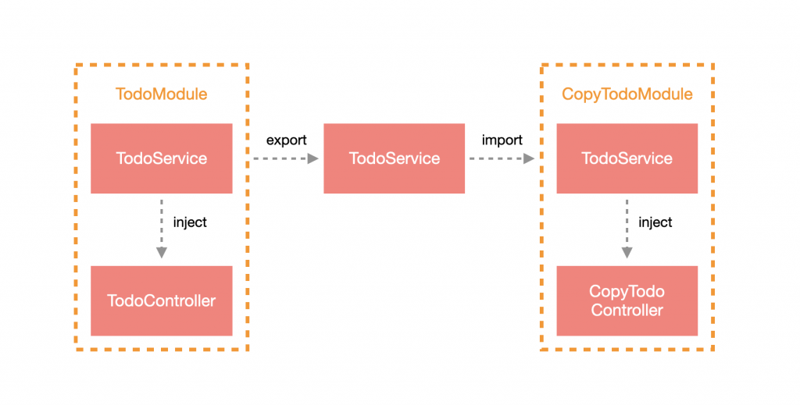

# 概述

模块（Module） 在 Nest 中是非常重要的一部分，它的作用主要是把相同性质的功能包装在一起，并依照各模块的需求来链接，而前面有提过整个 Nest App 必定会有一个根模块，Nest 会从根模块架构整个应用。

**把相同性质的功能包装在一起** 是什么意思呢？

我们这么来说，比如你去吃饭，我们把餐厅分成 川菜、湘菜、粤菜三个区块，每个区块都有他们负责的范围，不会出现你去川菜馆点粤菜的情况，因为川菜馆只提供川菜。换成 Nest 的角度来举例的话，比如我们有三个模块：`TodoModule`、`UserModule ` 和 `AuthModule`，正常来说，我们不会在 `UserModule` 里面去设计可以拿到 `Todo` 的功能，`UserModule` 只提供和用户相关的操作，达到各司其职的目的。

**依照各模块的需求来链接** 又是什么意思呢？

事实上，Module 的功能 **不一定** 要包含 Controller，它可以只是一个很单纯的功能所包装而成的模块，比如说：`MongooseModule`。以刚刚的示例来说，我们希望在湘菜和川菜中可以使用 小米辣 这个食物（因为都吃辣嘛），而粤菜就不用了，不合适，所以，我们可以把 **小米辣** 看作是一个共享的模块，在 川菜和湘菜中共用。

# 创建 Module

所有的 模块 都必须使用 `@Module` 装饰器来定义。可以通过 Nest CLI 快速生成 Module：

```shell
$ nest generate module <MODULE_NAME>
```

> **！注意**：`<MODULE_NAME>` 可以含有路径，如：`shared/todo`，这样就会在 `src` 目录下建立该路径并含有 Module。

这里我建立了一个名为 `todo` 的 Module：

```shell
$ nest g mo shared/todo
```

> **！提醒**：如果先前有按照教学建立 `TodoController` 的话，可以先移除，待会将会建立新的 Controller。

*`src/shared/todo.module.ts`* 内容：

```typescript
import { Module } from '@nestjs/common';

@Module({})
export class TodoModule {}
```

通常，一个模块包含 `service`、`module`、`controller` 三部分，其中：

- `module`：负责封装模块，包括导入、导出、控制器以及注入提供者。
- `service`：负责具体的业务逻辑实现。
- `controller`：负责路由，包括 `http` 请求的一些参数配置等

> **！提示**：通常，`controller` 只负责路由和参数的处理，所有的业务逻辑交由 `service`。

# 参数介绍

在建立完 Module 后我们可以发现 `@Module` 装饰器里面只有一个空对象，这是因为 Nest CLI 不确定使用者建立该模块的用途是什么，所以留空给使用者自行填入。那具体有哪些参数可以使用呢？主要有一下四项配置：

- `controllers`：将要归纳在该 Module 下的 Controller 放在这里，会在载入该 Module 时实例化它们。
- `exports`：这个 Module 下的部分 Provider 可能会在其他 Module 中使用，此时就可以把这些 Provider 放在这里进行导出。

- `providers`：将会使用到的 Provider 放在这里，比如说：Service。会在载入该 Module 时实例化它们
- `imports`：导入其他模块内的 Provider

# 模块类型

## 功能模块

大多数的 Module 都属于功能模块，其概念就是前面一直强调的：把相同性质的功能包装在一起。这边我们就先把 Controller 加到 Module 中，通过指令建立 Controller：

```shell
$ nest g co shared/todo
```

可以看到，`TodoModule` 会自动引入刚刚创建的 Controller 到 `controllers` 中：

```typescript
import { Module } from '@nestjs/common';
import { TodoController } from './todo.controller';

@Module({
  controllers: [TodoController],
})
export class TodoModule {}
```

前面有提过一个含有路由功能的模块通常都有 Controller 与 Service，这边我们先通过指令生成一个 Service，后续会再针对 Service 做说明：

```shell
$ nest g s shared/todo
```

稍微修改一下 `todo.service.ts` 的内容，大致上就是在 `TodoService` 建立一个 `getTodos` 方法返回 `todos` 的数据：

```typescript
import { Injectable } from '@nestjs/common';

@Injectable()
export class TodoService {
  private todos = [{ id: 1, title: 'Title 1', description: '' }];

  getTodos() {
    return this.todos;
  }
}
```

然后再修改 `todo.controller.ts` 的内容，在 `TodoController` 的 `constructor` 中 注入 `TodoService`：

```typescript
import { Controller, Get } from '@nestjs/common';
import { TodoService } from './todo.service';

@Controller('todos')
export class TodoController {
  constructor(private readonly todoService: TodoService) {}

  @Get('list')
  getAll() {
    return this.todoService.getTodos();
  }
}
```

这样就完成一个可以运转的功能模块了，那要如何使用它呢？很简单，只要在根模块中引入它就可以了，不过在我们通过CLI生成 Module 的时候就已经自动导入了，不需要手动去新增，是不是很方便呢！赶快打开浏览器查看：http://localhost:3000/todos/list

## 共享模块

在 Nest 中，默认情况下，模块是**单例**，因此你可以轻松地在多个模块之间共享**同一个**提供者实例。

事实上，每一个 Module 都是共享模块，只要遵照设计原则来使用，每个 Module 都具有高度的重用性，这也是前面强调的 **依照各模块的需求来链接**。这里我们可以做个简单的验证，把 `TodoService` 从 `TodoModule` 中**导出**：

```typescript
import { Module } from '@nestjs/common';
import { TodoController } from './todo.controller';
import { TodoService } from './todo.service';

@Module({
  controllers: [TodoController],
  providers: [TodoService],
  exports: [TodoService],
})
export class TodoModule {}
```

接着，创建一个新的 Module 和 Controller：

```shell
$ nest g mo shared/copy-todo
$ nest g co shared/copy-todo
```

这边调整一下 `todo.service.ts` 的内容，在 `TodoService` 新增一个 `createTodo` 的方法：

```typescript
import { Injectable } from '@nestjs/common';

@Injectable()
export class TodoService {
  private todos = [{ id: 1, title: 'Title 1', description: '' }];

  getTodos() {
    return this.todos;
  }

  createTodo(item: { id: number; title: string; description: string }) {
    this.todos.push(item);
  }
}
```

在 `CopyTodoModule` 中导入 `TodoModule`：

```typescript
import { Module } from '@nestjs/common';
import { TodoModule } from '../todo/todo.module';
import { CopyTodoController } from './copy-todo.controller';

@Module({
  controllers: [CopyTodoController],
  imports: [TodoModule],
})
export class CopyTodoModule {}
```

修改 `copy-todo.controller.ts` 的内容，在 `CopyTodoController` 的 `constructor` 注入 `TodoService`，并建立一个方法来调用 `createTodo`：

```typescript
import { Body, Controller, Post } from '@nestjs/common';
import { TodoService } from '../todo/todo.service';

@Controller('copy-todos')
export class CopyTodoController {
  constructor(private readonly todoService: TodoService) {}

  @Post()
  create(@Body() body: { id: number; title: string; description: string }) {
    this.todoService.createTodo(body);
    return body;
  }
}
```

通过 Postman 来测试：



然后在浏览器访问 http://localhost:3000/todos/list 查看结果 >>

这里我们可以得出一个结论，像 Service 这种 Provider 会在 Module 中建立一个实例，当其他模块需要使用该实例时，就可以通过导出的方式与其他 Module 共享。下方为简单的概念图：



## 全局模块

如果你不得不在任何地方导入相同的模块，那可能很烦人，我们可以将其提升为 **全局模块**，只需添加一个 `@Global` 装饰器即可，以 `TodoModule` 为例：

```typescript
import { Global, Module } from '@nestjs/common';
import { TodoController } from './todo.controller';
import { TodoService } from './todo.service';

@Global()
@Module({
  controllers: [TodoController],
  providers: [TodoService],
  exports: [TodoService],
})
export class TodoModule {}
```

> **！注意**：虽然可以通过提升为全局模块来减少导入的次数，但非必要情况应少用，这样才是好的设计准则。

## 常用模块

这是一种设计技巧，Module 可以不含任何 Controller 与 Provider，只单纯把导入的 Module 再导出，这样的好处是可以把多个常用的 Module 集中在一起，其他 Module 要使用的话只需要导入此 Module 就可以了。下方为示例代码：

```typescript
@Module({
  imports: [
    AModule,
    BModule
  ],
  exports: [
    AModule,
    BModule
  ],
})
export class CommonModule {}
```

# 小结

Module 在 Nest 是非常重要的角色，特别是有很核心的机制与 Provider 息息相关，下一篇会介绍这个机制，这里先做一个小结：

1. Module 把相同性质的功能包装在一起，并依照各模块的需求来串接。
2. Module 拥有 `controllers`、`providers`、`imports` 与 `exports` 四个参数。
3. 大部分的 Module 都是功能模块，其概念即为“把相同性质的功能包装在一起”。
4. 每个 Module 都是共享模块，其遵循著“依照各模组的需求来串接”的概念来设计。
5. 通过共享模块的方式来与其他模块共用同一个实例。
6. 可以通过全局模块来减少导入次数，但不该把多数模块做提升，在设计上不是很理想。
7. 善用常用模块的方式来统一管理多个常用模组。