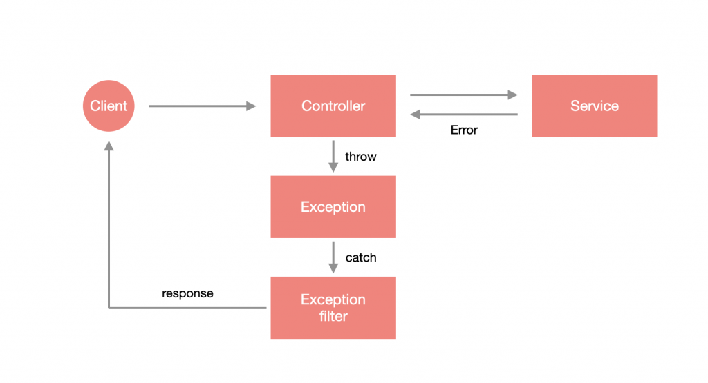

# 什么是 Exception？

简单来说就是系统发生了错误，导致原本程序无法完成的情况，这种时候会尽可能把错误转化为有效信息。通常一套系统都会针对错误做处理，提供有效的错误信息，就比如一家餐厅收到客人投诉必须出面回应客人，并要让客人觉得这个回覆是有经过系统整理的，而不是草率回应。

在 JavaScript 中，最常见的抛出错误方法就是使用 `Error`，这个 `Error` 即为 `Exception` 的概念，把错误信息包装起来变成统一格式：

```javascript
throw new Error('错误信息');
```

# Nest 错误处理机制

在抛出错误后，需要有个机制去捕捉这些错误，并从中提取错误信息来整理响应的格式，Nest 在底层已经帮我们做了一套错误处理机制 - **Exception filter**，它会去捕捉抛出的错误，并将错误信息、HttpCode 进行友善地包装：



我们可以做个小实验，修改一下 `app.controller.ts` 的内容，在 `getHello()` 裡直接抛出 Error：

```typescript
import { Controller, Get } from '@nestjs/common';
import { AppService } from './app.service';

@Controller()
export class AppController {
  constructor(private readonly appService: AppService) {}

  @Get()
  getHello(): string {
    throw new Error('出錯囉!');
    return this.appService.getHello();
  }
}
```

这时候通过浏览器查看 http://localhost:3000 会发现收到的错误信息跟我们定义的“出错囉!”不同：

```json
{
  "statusCode": 500,
  "message": "Internal server error"
}
```

原因是 Nest 内建的 Exception filter 会去侦测抛出的错误是什麽类型的，它只能够接受 Nest 内建的 `HttpException` 与继承该类别的 Exception，若不属于这类型的错误就会直接抛出 `Internal server error`。

# 标准Exception

Nest 内建的标准 Exception 即为 `HttpException`，它是一个标准的 `class`，提供非常弹性的使用体验，通过给定 `constructor` 两个必填参数来自定义错误信息与 `HttpCode`。这里先来进行简单的测试并修改 `app.controller.ts`：

```typescript
import { Controller, Get, HttpException, HttpStatus } from '@nestjs/common';
import { AppService } from './app.service';

@Controller()
export class AppController {
  constructor(private readonly appService: AppService) {}

  @Get()
  getHello(): string {
    throw new HttpException('出錯囉!', HttpStatus.BAD_REQUEST);
    return this.appService.getHello();
  }
}
```

通过浏览器查看 http://localhost:3000 会发现收到的错误信息和我们定义的是一致的：

```json
{
  "statusCode": 400,
  "message": "出錯囉!"
}
```

那如果现在我不想要用 Nest 的默认格式怎麽办呢？可以把第一个参数换成 `Object`，Nest 会自动 覆盖格式。这里一样做个简单的测试并修改 `app.controller.ts`：

```typescript
import { Controller, Get, HttpException, HttpStatus } from '@nestjs/common';
import { AppService } from './app.service';

@Controller()
export class AppController {
  constructor(private readonly appService: AppService) {}

  @Get()
  getHello(): string {
    throw new HttpException(
      {
        code: HttpStatus.BAD_REQUEST,
        msg: '出錯囉!',
      },
      HttpStatus.BAD_REQUEST,
    );
    return this.appService.getHello();
  }
}
```

通过浏览器查看 http://localhost:3000 会发现格式已经变成我们预期的样子了。

```json
{
  "code": 400,
  "msg": "出錯囉!"
}
```

# 内置HTTP异常

为了减少样板代码，Nest 提供了一系列继承自核心异常 `HttpException` 的可用异常。所有这些都可以在 `@nestjs/common`包中找到：

- `BadRequestException`
- `UnauthorizedException`
- `NotFoundException`
- `ForbiddenException`
- `NotAcceptableException`
- `RequestTimeoutException`
- `ConflictException`
- `GoneException`
- `PayloadTooLargeException`
- `UnsupportedMediaTypeException`
- `UnprocessableException`
- `InternalServerErrorException`
- `NotImplementedException`
- `BadGatewayException`
- `ServiceUnavailableException`
- `GatewayTimeoutException`

通常，你只需要在编辑器中输入 `HttpStatus.` ，然后通过代码提示功能即可查看内置的异常类。

现在我们用 `BadRequestException` 来测试，修改 `app.controller.ts`

```typescript
import { BadRequestException, Controller, Get } from '@nestjs/common';
import { AppService } from './app.service';

@Controller()
export class AppController {
  constructor(private readonly appService: AppService) {}

  @Get()
  getHello(): string {
    throw new BadRequestException('出錯囉!');
    return this.appService.getHello();
  }
}
```

通过浏览器查看 http://localhost:3000 会得到下面的内容：

```json
{
  "statusCode":400,
  "message":"出錯囉!",
  "error":"Bad Request"
}
```

如果你不想使用 Nest 默认的格式，同样可以传入一个对象来覆盖，这里不再累述。

# 自定义异常

大多数情况下不太需要自定义，因为 Nest 提供的 Exception 已经很够用了！不过如果当你确实有需要的时候，可以自行设计类别来继承 `HttpException`，达到自定义 Exception  的效果。 接下来我们新建文件：*`src/exceptions/custom.exception.ts`*

```typescript
import { HttpException, HttpStatus } from '@nestjs/common';

export class CustomException extends HttpException {
  constructor() {
    super('未知的錯誤', HttpStatus.INTERNAL_SERVER_ERROR);
  }
}
```

修改 `app.controller.ts` 进行测试：

```typescript
import { Controller, Get } from '@nestjs/common';
import { AppService } from './app.service';
import { CustomException } from './exceptions/custom.exception';

@Controller()
export class AppController {
  constructor(private readonly appService: AppService) {}

  @Get()
  getHello(): string {
    throw new CustomException();
    return this.appService.getHello();
  }
}
```

通过浏览器查看 http://localhost:3000 会发现与预期结果相同：

```JSON
{
  "statusCode":500,
  "message":"未知的錯誤"
}
```

# 自定义异常过滤器

如果希望完全掌握错误处理机制的话，Nest 是可以自订 Exception filter 的，通过这样的方式来添加 log，或是直接在这个层级定义响应的格式。Exception Filter 必须要使用 `@Catch(...exceptions: Type<any>[])` 装饰器来捕捉错误，可以指定要捕捉特定类别的 Exception，也可以捕捉全部的错误，若要捕捉全部就不需要带任何参数到 `@Catch` 里，另外，还需要让该 `class` 去实现 `ExceptionFilter<T>`，它会要求你必须在类中构建一个`catch(exception: T, host: ArgumentsHost)` 方法。

我们在 `src/common/filters` 下新增 `http-exception.filter.ts`，来建立一个捕捉 `HttpException` 的 Exception filter：

```typescript
import {
  ArgumentsHost,
  Catch,
  ExceptionFilter,
  HttpException,
} from '@nestjs/common';
import { Response } from 'express';

@Catch(HttpException)
export class HttpExceptionFilter implements ExceptionFilter<HttpException> {
  catch(exception: HttpException, host: ArgumentsHost) {
    const ctx = host.switchToHttp();
    const response = ctx.getResponse<Response>();
    const status = exception.getStatus();
    const message = exception.message;
    const timestamp = new Date().toISOString();

    const responseObject = {
      code: status,
      message,
      timestamp,
    };
    response.status(status).json(responseObject);
  }
}
```

这个示例主要是希望可以捕捉 `HttpException`，在捕捉时，会获得该 `Exception` 以及一个叫 `ArgumentsHost` 的东西，通过它来取得 `Response` 对象，进而响应下方的格式到客户端：

```json
{
  "code":500,
  "message":"未知的錯誤",
  "timestamp":"2022-05-25T08:25:04.718Z"
}
```

**应用上下文（ArgumentsHost）**

是一个用来取得当前请求相关参数（上下文）的类，它是一个抽象概念，由于 Nest 能够实现 REST API、WebSocket 与 MicroService，每个架构的参数都会有些不同，这时候通过抽象的方式做兼容是最合适的，以 Express 作为底层的 REST API 来说，它封装了 `Request`、`Response` 与 `NextFunction`，但如果是 MicroService 的话，封装的内容又不同了，所以 `ArgumentsHost` 提供了一些共同介面来取得这些底层的信息。

具体内容 [参考这里 >>](https://docs.nestjs.cn/8/fundamentals?id=%e5%ba%94%e7%94%a8%e4%b8%8a%e4%b8%8b%e6%96%87)

# 绑定异常过滤器

## @UseFilters()

如果你希望在某个路由或者直接在某个 Controller 上绑定异常过滤器时，可使用 `@UseFilters()` 装饰器：

```typescript
import { Controller, Get, UseFilters } from '@nestjs/common';
import { AppService } from './app.service';
import { HttpExceptionFilter } from './common/http-exception.filter';
import { CustomException } from './exceptions/custom.exception';

// -- 在整个控制器中绑定
@UseFilters(HttpExceptionFilter)
@Controller()
export class AppController {
  constructor(private readonly appService: AppService) {}

  // -- 在指定路由中绑定
  @UseFilters(HttpExceptionFilter)
  @Get()
  getHello(): string {
    throw new CustomException();
    return this.appService.getHello();
  }
}
```

## 全局注册

### eg1：通过 app.use 实现

```typescript
import { NestFactory } from '@nestjs/core';
import { AppModule } from './app.module';
import { HttpExceptionFilter } from './common/http-exception.filter';

async function bootstrap() {
  const app = await NestFactory.create(AppModule);
  app.useGlobalFilters(new HttpExceptionFilter());
  await app.listen(3000);
}
bootstrap();
```

### eg2：通过依赖注入的形式实现

```typescript
import { Module } from '@nestjs/common';
import { APP_FILTER } from '@nestjs/core';
import { AppController } from './app.controller';
import { AppService } from './app.service';
import { HttpExceptionFilter } from './common/http-exception.filter';

@Module({
  controllers: [AppController],
  providers: [
    AppService,
    {
      provide: APP_FILTER,
      useClass: HttpExceptionFilter,
    },
  ],
})
export class AppModule {}
```

# 拓展：自定义全局异常捕获

这里主要是我在项目实战中封装的自定义全局异常捕获，大家可以参考下：

```typescript
import { ExceptionFilter, Catch, ArgumentsHost, HttpException, HttpStatus, Logger } from '@nestjs/common';
import { Response } from 'express';

const logger = new Logger('all-exceprtion.filter');

// -- 捕获所有异常
@Catch()
export class GlobalExceptionsFilter implements ExceptionFilter {
  // -- exception：当前正在处理的异常对象
  // -- host：传递给原始处理程序的参数的一个包装（Request/Response）的引用
  catch(exception: any, host: ArgumentsHost) {
    const ctx = host.switchToHttp(); /** 获取请求上下文 */
    const request = ctx.getRequest<Request>(); /** 获取请求上下文中的request对象 */
    const response = ctx.getResponse<Response>(); /** 获取请求上下文中的response对象 */
    const status = exception instanceof HttpException ? exception.getStatus() : HttpStatus.INTERNAL_SERVER_ERROR;
    const message = status >= 500 ? '服务器繁忙~' : exception.message;
    logger.error(`异常信息 >> ${exception}`);
    // -- 抛出错误信息
    // -- 和全局响应拦截结构保持一致
    response.status(200).json({
      code: status,
      data: null,
      msg: message,
    });
  }
}
```

# 小结

要如何做好错误处理是一门学问，Nest 提供了标准化却不失弹性的解决方案，通过 Exception 定义错误格式，并经由 Exception filter 统一处理这些错误，省去了很多麻烦。

1. `Exception` 错误对象。
2. Nest 内建的标准 `Exception` 为 `HttpException`。
3. Nest 内建错误处理机制，名为 `Exception filter`，会自动处理错误并包装响应格式。
4. 内建的 `Exception filter` 在收到非 `HttpException` 系列的 `Exception` 时，会统一回覆 Internal server error。
5. `HttpException` 可以通过给定 `Object` 来覆写格式。
6. Nest 内建大量的 `Http Exception`。
7. 可以自订 `Exception filter`，并可以套用至单一资源、Controller 或全域。
8. 全域 `Exception filter` 可以通过依赖注入的方式实作。