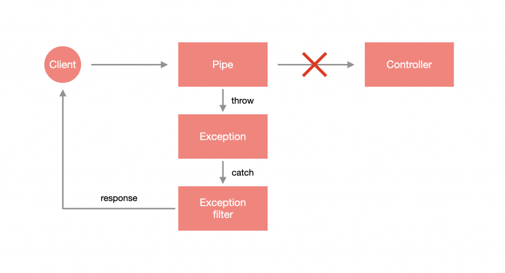
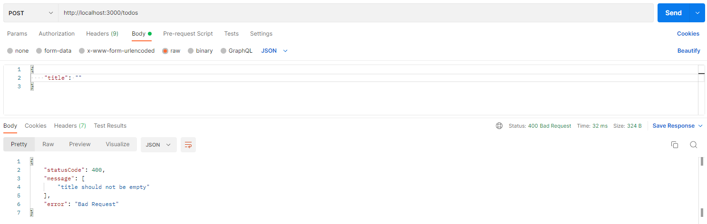
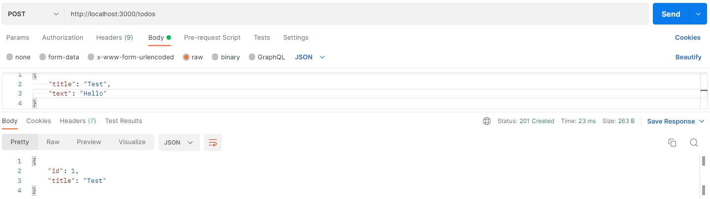

# 什么是管道（Pipe）?

[官方文档 >>](https://docs.nestjs.cn/8/pipes)

**管道**（Pipes）是一个用 `@Injectable()` 装饰过的类，它必须实现 `PipeTransform` 接口。

管道有两个类型:

- **转换**：将输入数据转换为所需的数据输出
- **验证**：对输入数据进行验证，如果验证成功继续传递，验证失败则抛出异常;

通俗来讲就是对请求接口的入参进行验证和转换的前置操作，验证好了才会将内容给到路由对应的方法中去。

在 Nest 中，管道支持 Exception 的错误处理机制，当在管道抛出异常时，当前请求就 **不会** 进入到 Controller 对应的方法里，这样的设计方法能够有效隔离验证程序与主执行程序，是非常好的实现方式。



Nest 提供了几个开箱即用的管道。

- `ValidationPipe`
- `ParseIntPipe`
- `ParseBoolPipe`
- `ParseArrayPipe`
- `ParseUUIDPipe`

# 使用管道

管道的使用方式很简单，假设要解析并验证路由参数是否为 `Integer` 的话，只需要在 `@Param` 装饰器填入路由参数名称并带入 `ParseIntPipe` 即可。以 `app.controller.ts` 为例，如果 `id` 解析后为数字，就会通过 `AppService` 去取得对应的 `User` 数据，否则会抛出 `Exception`：

```typescript
import { Controller, Get, Param, ParseIntPipe } from '@nestjs/common';
import { AppService } from './app.service';

@Controller()
export class AppController {
  constructor(private readonly appService: AppService) {}

  @Get(':id')
  getUser(@Param('id', ParseIntPipe) id: number) {
    return this.appService.getUser(id);
  }
}
```

调整 `app.service.ts`

```typescript
import { Injectable } from '@nestjs/common';

@Injectable()
export class AppService {
  getUser(id: number) {
    const users = [{ id: 1, name: 'Li-HONGYAO' }];
    const user = users.find((item) => item.id === id);
    return user || {};
  }
}
```

通过浏览器查看 http://localhost:3000/hello 会收到错误信息，因为路由参数为 `hello`，并不能解析为 `Integer`

```json
{
  "statusCode": 400,
  "message": "Validation failed (numeric string is expected)",
  "error": "Bad Request"
}
```

## 内置管道自定义 HttpCode

假设想要更改错误信息，那 `ParseIntPipe` 就必须实例化并带入相关参数，以 `app.controller.ts` 为例，我希望出错时收到的 `HttpCode` 是 `406`：

```typescript
import { Controller, Get, HttpStatus, Param, ParseIntPipe } from '@nestjs/common';
import { AppService } from './app.service';

@Controller()
export class AppController {
  constructor(private readonly appService: AppService) {}

  @Get(':id')
  getUser(@Param('id', new ParseIntPipe({ errorHttpStatusCode: HttpStatus.NOT_ACCEPTABLE })) id: number) {
    return this.appService.getUser(id);
  }
}
```

通过浏览器查看 http://localhost:3000/hello 会得到下方结果：

```json
{
  "statusCode": 406,
  "message": "Validation failed (numeric string is expected)",
  "error": "Not Acceptable"
}
```

## 内置管道自定义 Exception

如果想要自订错误信息的话，可以使用 `exceptionFactory` 这个参数来指定产生的 Exception。以 `app.controller.ts` 为例：

```typescript
import { Controller, Get, NotAcceptableException, Param, ParseIntPipe } from '@nestjs/common';
import { AppService } from './app.service';

@Controller()
export class AppController {
  constructor(private readonly appService: AppService) {}

  @Get(':id')
  getUser(
    @Param(
      'id',
      new ParseIntPipe({
        exceptionFactory: () => new NotAcceptableException('无法解析为数字')
      })
    )
    id: number
  ) {
    return this.appService.getUser(id);
  }
}
```

通过浏览器查看 http://localhost:3000/hello 会得到下方结果：

```javascript
{
  "statusCode": 406,
  "message": "无法解析为数字",
  "error": "Not Acceptable"
}
```

# 自定义管道

如果觉得内置管道无法满足需求的话，Nest 是可以自定义 Pipe 的，事实上，Pipe 就是一个带有 `@Injectable` 的 `class`，不过它要去实现 `PipeTransform` 这个接口。Pipe 可以通过 CLI 生成：

```shell
$ nest generate pipe <PIPE_NAME>
```

> **！注意**：`<PIPE_NAME>` 可以含有路径，如：`core/pipes/parse-int`，这样就会在 `src` 目录下建立该路径并含有 Pipe。

现在我们新建一个 `ParseIntPipe`：

```shell
$ nest g pi core/pipes/parse-int
```

下方为默认生成的文件内容，会看到有一个 `transform(value: any, metadata: ArgumentMetadata)` 方法，这就是要做逻辑判断的地方，其中，`value` 为传进来的值，`metadata` 为当前正在处理的参数元数据：

```typescript
import { ArgumentMetadata, Injectable, PipeTransform } from '@nestjs/common';

@Injectable()
export class ParseIntPipe implements PipeTransform {
  transform(value: any, metadata: ArgumentMetadata) {
    return value;
  }
}
```

> **！注意**：`PipeTransform` 后面可以添加两个 `Type`，第一个为 `T`，定义传入的值应该为何种型别，也就是 `transform` 里面的 `value`，第二个为 `R`，定义回传的数据类型。

现在我们调整一下 `parse-int.pipe.ts`，经过 `parseInt` 之后的 `value` 是否为 `NaN`，如果是则会抛出 `NotAcceptableException`：

```typescript
import { ArgumentMetadata, Injectable, NotAcceptableException,  PipeTransform } from '@nestjs/common';

@Injectable()
export class ParseIntPipe implements PipeTransform<string, number> {
  transform(value: string, metadata: ArgumentMetadata) {
    const integer = parseInt(value);
    if (isNaN(integer)) {
      throw new NotAcceptableException('无法解析为数字');
    }
    return integer;
  }
}
```

接着去修改 `app.controller.ts`，来使用我们刚刚自己设计的 `ParseIntPipe`：

```typescript
import { Controller, Get, Param } from '@nestjs/common';
import { AppService } from './app.service';
import { ParseIntPipe } from './core/pipes/parse-int.pipe';

@Controller()
export class AppController {
  constructor(private readonly appService: AppService) {}

  @Get(':id')
  getUser(@Param('id', ParseIntPipe) id: number) {
    return this.appService.getUser(id);
  }
}
```

通过浏览器查看 http://localhost:3000/hello 会得到下方结果：

```javascript
{
  "statusCode": 406,
  "message": "无法解析为数字",
  "error": "Not Acceptable"
}
```

# DTO 格式验证

前面章节有提到如果遇到对象格式的数据要如何做验证这个问题，事实上我们只需要通过 `DTO`、`ValidationPipe`、[`class-validator`](https://github.com/typestack/class-validator) 以及 [`class-transformer`](https://github.com/typestack/class-transformer) 即可实现。

首先我们安装所需依赖：

```shell
$ npm install --save class-validator class-transformer
```

为了模拟验证机制，我们创建一个 `todo` 模块：

```shell
$ nest g mo shared/todo
$ nest g co shared/todo
```

> **！提示**：如果你之前以前创建过了，可以删除有关代码再跟着走一遍，加深印象 O(∩_∩)O

接着，新建 dto 文件：`todo/dto/create-dto.ts`

在验证格式机制上，建议使用 `class` 的形式建立 `DTO`，因为使用 `interface` 的方式在编译成 `JavaScript` 时会被删除，如此一来，Nest 便无法得知 `DTO` 的格式是什么。这里我们先简单定义一下 `create-todo.dto.ts` 的内容：

```typescript
export class CreateTodoDto {
  title: string;
  description?: string;
}
```

我希望 `title` 的规则如下：

1. 为必填
2. 必须是 `String` 类型
3. 最大长度为 `20`

`description ` 的规则如下：

1. 为选填
2. 必须是 `String` 类型

那要如何套用这些规则呢？非常简单，通过 `class-validator` 就能办到，主要是替这些属性添加特定的装饰器：

```typescript
import { IsNotEmpty, IsOptional, IsString, MaxLength } from 'class-validator';

export class CreateTodoDto {
  @MaxLength(20)
  @IsString()
  @IsNotEmpty()
  title: string;

  @IsString()
  @IsOptional()
  description?: string;
}
```

> **！提示**：詳細的裝飾器內容可以參考 [class-validator >>](https://github.com/typestack/class-validator)。

如此一来便完成了规则的定义，实在是太好用啦！接下来只需要在资源上通过 `@UsePipes` 装饰器使用 `ValidationPipe` 即可：

```typescript
import { Body, Controller, Post, UsePipes, ValidationPipe } from '@nestjs/common';
import { CreateTodoDto } from './dto/create-todo.dto';

@Controller('todos')
export class TodoController {
  @Post()
  @UsePipes(ValidationPipe)
  create(@Body() dto: CreateTodoDto) {
    return { id: 1, ...dto };
  }
}
```

在 Controller 层级使用也可以，就会变成该 Controller 下的所有资源都支持验证：

```typescript
import { Body, Controller, Post, UsePipes, ValidationPipe } from '@nestjs/common';
import { CreateTodoDto } from './dto/create-todo.dto';

@UsePipes(ValidationPipe)
@Controller('todos')
export class TodoController {
  @Post() 
  create(@Body() dto: CreateTodoDto) {
    return { id: 1, ...dto };
  }
}
```

通过 Postman 来测试，会发现顺利报错：



## 可选配置

如果设计DTO验证结构时使用了 `class-validator` 和 `class-transformer` 库，那么在使用管道时我们可以通过 `new` 的形式实例化管道并设置一些可选的配置参入：

```typescript
export interface ValidationPipeOptions extends ValidatorOptions {
  transform?: boolean;
  disableErrorMessages?: boolean;
  exceptionFactory?: (errors: ValidationError[]) => any;
}
```

所有可用的`class-validator`选项（继承自`ValidatorOptions`接口）：

| 选项                          | 类型       | 描述                                                         |
| :---------------------------- | :--------- | :----------------------------------------------------------- |
| `enableDebugMessages`         | `boolean`  | 如果设置为 `true` ，验证器会在出问题的时候打印额外的警告信息 |
| `skipUndefinedProperties`     | `boolean`  | 如果设置为 `true` ，验证器将跳过对所有验证对象中值为 `null` 的属性的验证 |
| `skipNullProperties`          | `boolean`  | 如果设置为 `true` ，验证器将跳过对所有验证对象中值为 `null` 或 `undefined` 的属性的验证 |
| `skipMissingProperties`       | `boolean`  | 如果设置为 `true` ，验证器将跳过对所有验证对象中缺失的属性的验证 |
| `whitelist` **！**            | `boolean`  | 如果设置为 `true` ，验证器将去掉没有使用任何验证装饰器的属性的验证（返回的）对象 |
| `forbidNonWhitelisted` **！** | `boolean`  | 如果设置为 `true` ，验证器不会去掉非白名单的属性，而是会抛出异常 |
| `forbidUnknownValues`         | `boolean`  | 如果设置为 `true` ，尝试验证未知对象会立即失败               |
| `disableErrorMessage` **！**  | `boolean`  | 如果设置为 `true` ,验证错误不会返回给客户端                  |
| `errorHttpStatusCode`         | `number`   | 这个设置允许你确定在错误时使用哪个异常类型。默认抛出 `BadRequestException` |
| `exceptionFactory` **！**     | `Function` | 接受一个验证错误数组并返回一个要抛出的异常对象               |
| `groups`                      | `string[]` | 验证对象时使用的分组                                         |
| `always`                      | `boolean`  | 设置装饰器选项 `always` 的默认值。默认值可以在装饰器的选项中被覆写 |
| `strictGroups`                | `boolean`  | 忽略在任何分组内的装饰器，如果 `groups` 没有给出或者为空     |
| `dismissDefaultMessages`      | `boolean`  | 如果设置为 `true` ，将不会使用默认消息验证，如果不设置，错误消息会始终是 `undefined` |
| `validationError.target`      | `boolean`  | 确定目标是否要在 `ValidationError` 中暴露出来                |
| `validationError.value`       | `boolean`  | 确定验证值是否要在 `ValidationError` 中暴露出来              |
| `stopAtFirstError`            | `boolean`  | 如果设置为 `true` ，对于给定的属性的验证会在触发第一个错误之后停止。默认为 `false` |

下面我们简单举例：

### 隐藏错误信息

如果你不想回传错误信息 `message`，可以通过配置 `ValidationPipe` 的 `disableErrorMessages` 属性来实现。

```typescript
import { Body, Controller, Post, UsePipes, ValidationPipe } from '@nestjs/common';
import { CreateTodoDto } from './dto/create-todo.dto';

@UsePipes(new ValidationPipe({ disableErrorMessages: true }))
@Controller('todos')
export class TodoController {
  @Post() 
  create(@Body() dto: CreateTodoDto) {
    return { id: 1, ...dto };
  }
}
```

通过 Postman 进行测试：


### 自定义 Exception

与其他 Pipe 一样可以通过 `exceptionFactory` 自定义 Exception：

```typescript
import {
  Body,
  Controller,
  HttpStatus,
  NotAcceptableException,
  Post,
  UsePipes,
  ValidationPipe,
} from '@nestjs/common';
import { ValidationError } from 'class-validator';
import { CreateTodoDto } from './dto/create-todo.dto';

@Controller('todos')
export class TodoController {
  @UsePipes(
    new ValidationPipe({
      exceptionFactory: (errors: ValidationError[]) => {
        return new NotAcceptableException({
          code: HttpStatus.NOT_ACCEPTABLE,
          message: '格式錯誤',
          errors
        });
      }
    })
  )
  @Post()
  create(@Body() dto: CreateTodoDto) {
    return { id: 1, ...dto };
  }
}
```

通过 Postman 进行测试：


### 自动过滤属性

以前面新增 Todo 的例子来说，可接受的参数为 `title` 与 `description`，假设客户端传送下方的数据：

```json
{
  "title": "Test",
  "text": "Hello."
}
```

可以发现传了一个毫无关联的 `text`，这时候想要快速过滤掉这种无效参数该怎麽做呢？通过 `ValidationPipe` 设置 `whitelist` 即可，当 `whitelist` 为 `true` 时，会 **自动过滤掉于 DTO 没有任何装饰器的属性**，也就是说，就算有该属性但没有添加 `class-validator` 的装饰器也会被视为无效属性。这里我们简单实验一下 `whitelist`：

```typescript
import { Body, Controller, Post, UsePipes, ValidationPipe } from '@nestjs/common';
import { CreateTodoDto } from './dto/create-todo.dto';

@Controller('todos')
export class TodoController {
  @UsePipes(new ValidationPipe({ whitelist: true }))
  @Post()
  create(@Body() dto: CreateTodoDto) {
    return { id: 1, ...dto };
  }
}

```

通过 Postman 进行测试：



如果想要在传送无效参数时直接报错的话，则是同时使用 `whitelist` 与 `forbidNonWhitelisted`：

```typescript
import { Body, Controller, Post, UsePipes, ValidationPipe } from '@nestjs/common';
import { CreateTodoDto } from './dto/create-todo.dto';

@Controller('todos')
export class TodoController {
  @UsePipes(new ValidationPipe({ whitelist: true, forbidNonWhitelisted: true }))
  @Post()
  create(@Body() dto: CreateTodoDto) {
    return { id: 1, ...dto };
  }
}
```

通过 Postman 进行测试：


### 自动转换

`ValidationPipe` 还提供 `transform` 参数来转换传入的对象，将其实例化为对应的 DTO：

```typescript
import { Body, Controller, Post, UsePipes, ValidationPipe } from '@nestjs/common';
import { CreateTodoDto } from './dto/create-todo.dto';

@Controller('todos')
export class TodoController {
  @UsePipes(new ValidationPipe({ transform: true }))
  @Post()
  create(@Body() dto: CreateTodoDto) {
    console.log(dto);
    return { id: 1, ...dto };
  }
}
```

通过 Postman 进行测试，然后观察控制台输出，可以发现 `dto` 为 `CreateTodoDto` 实例：

```
CreateTodoDto { title: 'Test', text: 'Hello' }
```

`transform` 还有一个很厉害的功能，还记得如何取得路由参数吗？假设路由参数要取得 `id`，这个 `id` 类型是 `number`，但正常来说路由参数收到的时候都会是 `string`，通过 `transform` Nest 会尝试去转换成我们指定的类型：

```typescript
import { Controller, Get, Param, UsePipes, ValidationPipe } from '@nestjs/common';

@Controller('todos')
export class TodoController {

  @Get(':id')
  @UsePipes(new ValidationPipe({ transform: true }))
  get(@Param('id')id : number) {
    console.log(typeof id);
    return '';
  }
}
```

通过浏览器查看 http://localhost:3000/todos/1，然后在控制台可以看到 `id` 属性的类型确实被转换成 `number` 了。

## DTO 技巧

当系统越来越庞大的时候，DTO 的数量也会随之增加，有许多的 DTO 会有重复的属性，例如：相同资源下的 CRUD DTO，这时候就会变得较难维护，还好 Nest 有提供良好的解决方案，运用特殊的继承方式来处理，不过可能你首先需要安装依赖：

```shell
$ npm install @nestjs/mapped-types
```

然后我们先看一下Nest提供了几种方式来处理：

- `PartialType(输入类型)`：将输入类型里面的字段全部变可选；
- `PickType(输入类型, [...挑选字段])`：挑选输入类型里的指定字段组成一个新的类型；

- `OmitType(输入类型, [...移除字段])`：移除输入类型里的指定字段，将剩余类型组成一个新的类型；
- `IntersectionType(输入类型A，输入类型B...)`：合并类型

> **！注意**：以上操作都会组成一个新的类型。

接下来，直接贴出示例代码：

```typescript
// 1. 基础类型
export class UserDto {
  id: string;
  phone: string;
  password: string;
  job: string;
  sex: string;
}

// 2. 移除指定类型，生成类型：{ phone, password, job, sex }
export class A extends OmitType(UserDto, ['id']) {}

// 3. 挑选指定类型，生成类型：{ id, job }
export class B extends PickType(UserDto, ['id', 'job']) {}

// 4. 生成类型：{ phone?, password?, job?, sex? }
export class C extends PartialType(UserDto) {}
```

> **！提示**：更多细节可 [参考官网 >>](https://docs.nestjs.cn/8/techniques?id=%e6%98%a0%e5%b0%84%e7%b1%bb%e5%9e%8b)

# 全局管道验证

`ValidationPipe` 算是一个蛮常用的功能，因为大多数的情况都会使用到 DTO 的概念，如此一来便可以使用 DTO 验证的方式去检查数据的正确性，所以可以直接将 `ValidationPipe` 配置在全局。

## eg1：通过 app.use 实现

仅需要修改 `main.ts` 即可：

```typescript
import { ValidationPipe } from '@nestjs/common';
import { NestFactory } from '@nestjs/core';
import { AppModule } from './app.module';

async function bootstrap() {
  const app = await NestFactory.create(AppModule);
  app.useGlobalPipes(new ValidationPipe());
  await app.listen(3000);
}
bootstrap();
```

## eg2：通过依赖注入的形式实现

```typescript
import { Module, ValidationPipe } from '@nestjs/common';
import { APP_PIPE } from '@nestjs/core';
import { AppController } from './app.controller';
import { AppService } from './app.service';
import { TodoModule } from './shared/todo/todo.module';

@Module({
  imports: [TodoModule],
  controllers: [AppController],
  providers: [
    AppService,
    {
      provide: APP_PIPE,
      useClass: ValidationPipe
    }
  ],
})
export class AppModule {}
```

# 拓展

## 实战中使用自定义管道

在实际开发中，我通常习惯性的将响应前端的结构变成如下结构：

```typescript
export interface IResponse<T = any> {
  code?: number;
  data?: T;
  msg?: string;
}
```

通常 `msg` 为字符串，当 `code` 不为 `0` 时表示异常（包括程序异常 / 逻辑异常），前端直接通过 `msg` 弹出异常信息，而管道验证当有多个条件不满足时，是以数组的形式返回的，所以我一般自定义 Pipe，当出现这种情况时，将错误信息列表中的第1条信息返回给前端。下面是具体实现：

```typescript
import { ArgumentMetadata, BadRequestException, Injectable, PipeTransform } from '@nestjs/common';
import { plainToClass } from 'class-transformer';
import { validate } from 'class-validator';

@Injectable()
export class ValidationPipe implements PipeTransform<any> {
  // -- value：当前处理参数
  // -- metatype：属性的元类型
  async transform(value: any, { metatype }: ArgumentMetadata) {
    if (!metatype || !this.toValidate(metatype)) {
      return value;
    }
    // -- plainToClass将普通的JavaScript对象转换为特定类的实例
    const object = plainToClass(metatype, value);
    // -- 验证该对象返回出错的数组
    const errors = await validate(object);
    if (errors.length > 0) {
      // -- 将错误信息数组中的第一个内容返回给异常过滤器
      const constraints = errors.shift().constraints;
      const k = Object.keys(constraints)[0];
      const errorMsg = constraints[k];
      throw new BadRequestException(errorMsg);
    }
    return value;
  }
  private toValidate(metatype: Function): boolean {
    const types: Function[] = [String, Boolean, Number, Array, Object];
    return !types.includes(metatype);
  }
}
```


