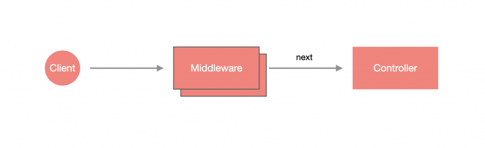

# 什么是中间件？

中间件是一种执行于路由处理之前的函数，中间件函数可以访问请求和响应对象，并通过 `next()` 继续完成后续的流程。

中间件函数可以执行以下任务:

- 执行任何代码。
- 对请求和响应对象进行更改。
- 结束请求-响应周期。
- 调用堆栈中的下一个中间件函数。
- 如果当前的中间件函数没有结束请求-响应周期, 它必须调用 `next()` 将控制传递给下一个中间件函数。否则, 请求将被挂起。



# 实现方式

Nest 提供了两种方式创建中间件。

## Functional middleware

这种中间件十分单纯，就是一个普通的 `function`，不过有三个参数，分别是：`Request`、`Response` 以及 `NextFunction`，使用方法与 `Express middleware` 是一样的。下方是一个简单的示例，可以看到在函数结尾的地方调用了 `next()`，表示将执行下一个执行步骤：

```typescript
import { Request, Response, NextFunction } from 'express';

export function logger(req: Request, res: Response, next: NextFunction) {
  console.log('Hello Request!');
  next();
}
```

## Class middleware

这种中间件可以通过 CLI 生成：

```shell
$ nest generate middleware <MIDDLEWARE_NAME>
```

> **！注意**：`<MIDDLEWARE_NAME>` 可以含有路径，如：`common/middlewares/logger`，这样就会在在 `src` 目录下建立该路径并含有 Middleware。

我们尝试创建一个 `logger` 中间件：

```shell
$ nest g mi common/middlewares/logger 
```

生成代码如下：

```typescript
import { Injectable, NestMiddleware } from '@nestjs/common';

@Injectable()
export class LoggerMiddleware implements NestMiddleware {
  use(req: any, res: any, next: () => void) {
    next();
  }
}
```

可以看到，`req` 和 `res` 的类型为 `any`，这是因为 Nest 不知道你是基于什么使用的，如果你确定是使用 Express，就改成下面的样子：

```typescript
import { Injectable, NestMiddleware } from '@nestjs/common';
import { NextFunction, Request, Response } from 'express';

@Injectable()
export class LoggerMiddleware implements NestMiddleware {
  use(req: Request, res: Response, next: NextFunction) {
    console.log('Hello Request!');
    next();
  }
}
```

# xxxxxxxxxx import { Injectable, OnModuleInit } from '@nestjs/common';​@Injectable()export class UsersService implements OnModuleInit {  onModuleInit() {    console.log(`The module has been initialized.`);  }}​typescript

## configure()

```typescript
import { MiddlewareConsumer, Module } from '@nestjs/common';
import { AppController } from './app.controller';
import { AppService } from './app.service';
import { LoggerMiddleware } from './common/middlewares/logger.middleware';

@Module({
  controllers: [AppController],
  providers: [AppService],
})
export class AppModule {
  configure(consumer: MiddlewareConsumer) {
    consumer.apply(LoggerMiddleware).exclude(...).forRoutes(...);
  }
}
```

具体使用可参照 [官网示例 >>](https://docs.nestjs.cn/8/middlewares?id=%e5%ba%94%e7%94%a8%e4%b8%ad%e9%97%b4%e4%bb%b6)

## 全局使用

需要注意的是，只有 **函数中间件** 可以全局使用，使用方式如下：

```
app.use(函数中间件);
```

# 示例

## 示例1：加密中间件

首先我们定义一个工具函数，用于加密前端传递过来的密码：

*`src/utils/encription.ts`*

```typescript
import * as crypto from 'crypto';

// -- 获取盐
export function getSalt() {
  return crypto.randomBytes(16).toString('base64');
}

// -- 加密
export function encript(password: string, salt: string) {
  return crypto.pbkdf2Sync(password, salt, 10000, 16, 'sha256').toString('base64');
}
```

然后我们定义中间件文件：

*`src/common/middleware/hash-password.middleware.ts`*

```typescript
import { Injectable, NestMiddleware } from '@nestjs/common';
import { Request, Response, NextFunction } from 'express';
import { encript, getSalt } from 'src/utils/encription';

@Injectable()
export class HashPasswordMiddleware implements NestMiddleware {
  use(req: Request, res: Response, next: NextFunction) {
    // -- 获取请求体中的密码
    const userPassword = req.body['password'];
    if (userPassword) {
      const salt = getSalt();
      // -- 将加密后的密码替换
      req.body['password'] = encript(userPassword, salt);
      // -- 存储盐值，验证登录时我们将客户端传递过来的密码用这个盐值加密并比对存储的加密密码用于判断是否登录成功
      req.body['salt'] = salt;
    }
    next();
  }
}
```

接下来我们在 *`src/shared/auth/auth.module.ts`* 文件中引入中间件，并让其只在 *`auth/regist`* 路由中生效：

```typescript
import { MiddlewareConsumer, Module } from '@nestjs/common';
import { AuthController } from './auth.controller';
import { AuthService } from './auth.servce';
import { HashPasswordMiddleware } from 'src/common/middleware/hash-password.middleware';

@Module({
  imports: [],
  controllers: [AuthController],
  providers: [AuthService],
})
export class AuthModule {
  configure(consumer: MiddlewareConsumer) {
    consumer.apply(HashPasswordMiddleware).forRoutes('auth/regist');
  }
}
```

当你在 *`auth/regist`* 路由中获取请求体的参数时，将会取到在中间件 `HashPasswordMiddleware` 加密后的密码和盐，通常你应该将其存入数据库中，当用户执行登录时，首先从数据库读取用户数据，然后将客户端传递过来的密码通过注册时存储的盐值进行加密然后和注册时存储在数据库中的加密后的密码进行比较来验证是否登录成功，后续的代码这里不会贴出示例，只是提供一个思路，你可以在 **jwt验证** 章节查看具体代码。

## 示例2：全局 visitor 中间件

本示例主要讲解  `visitor` 中间件的使用，该中间件主要用于打印访问者信息：

1）定义中间件：*`src/common/middleware/visitor.middleware.ts`*

```typescript
import { Logger } from '@nestjs/common';
import { Request, Response, NextFunction } from 'express';

const logger = new Logger('logger.middleware');
export function visitor(req: Request, res: Response, next: NextFunction) {
  const { method, path, ip } = req;
  logger.log(`visit：${method} ${path} at ${ip}`);
  next();
}
```

2）全局使用

```typescript
app.use(visitor);
```

> **Tips：**
>
> - 只有函数组件支持全局使用。
> - 同一路由注册多个中间件的执行顺序为，先是全局中间件执行，然后是模块中间件执行，模块中的中间件顺序按照 `.apply` 中注册的顺序执行
> - 模块中使用可参照 [官方示例 >>](https://docs.nestjs.cn/8/middlewares?id=%e5%ba%94%e7%94%a8%e4%b8%ad%e9%97%b4%e4%bb%b6)

# 小结

中间件的用途非常广泛，有许多应用都是基于中间件进行实现的，比如：`cros`

1. 中间件是一种执行于路由处理之前的函数，中间件函数可以访问请求和响应对象。
2. 中间件有两种设计方式：**函数中间件** 和 **类中间件**。
3. 在模块中实现 `NestModule` 接口并设计 `configure()` 方法，再通过 `MiddlewareConsumer` 可以管理中间件。
4. 可以把一个或多个中间件应用在一个或多个路由、`HttpMethod` 或 `Controller` 上。
5. 可以排除特定路由，让该路由使用中间件。
6. 可以将中间件应用在全局。
7. 全局中间件只能使用 函数中间件。
