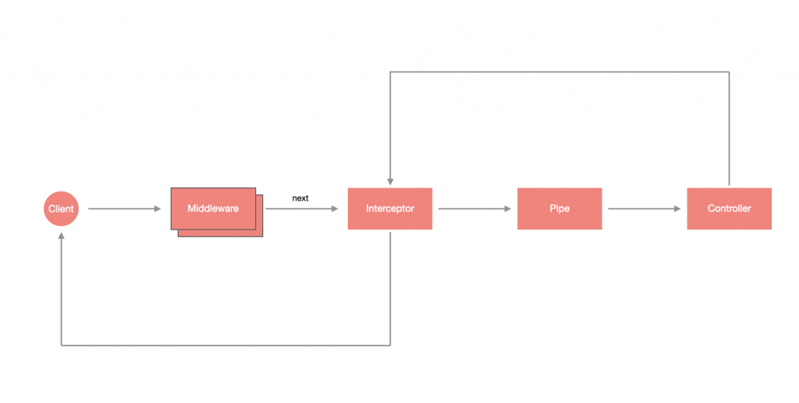

# 什么是拦截器？

受面向切面编程（AOP，**A**spect **O**riented **P**rogramming）技术的启发，为原功能扩展逻辑，其特点如下：

- 在函数执行之前/之后绑定**额外的逻辑**
- 转换从函数返回的结果
- **转换**从函数抛出的异常
- 扩展基本函数行为
- 根据所选条件完全重写函数 (例如, 缓存目的)



> **！提示**：拦截器是使用 `@Injectable()` 装饰器注解的类。拦截器应该实现 `NestInterceptor` 接口。

# 创建 Interceptor

Interceptor 可以通过 CLI 创建：

```shell
$ nest generate interceptor <INTERCEPTOR_NAME>
```

> **！注意**：`<INTERCEPTOR_NAME>` 可以含有路径，如：`core/interceptors/hello-world`，这样就会在 `src` 目录下建立该路径并含有 Interceptor。

这里我们新建一个 `hello-world` 拦截器：

```shell
$ nest g in core/interceptors/hello-world
```

生成文件的基本结构如下：

```typescript
import { CallHandler, ExecutionContext, Injectable, NestInterceptor } from '@nestjs/common';
import { Observable } from 'rxjs';

@Injectable()
export class HelloWorldInterceptor implements NestInterceptor {
  intercept(context: ExecutionContext, next: CallHandler): Observable<any> {
    return next.handle();
  }
}
```

可以发现，拦截器其实也是带有 `@Injectable` 装饰器的 `class`，不过它必须实现 `NestInterceptor` 接口，并设计 `intercept(context: ExecutionContext, next: CallHandler)` 方法。 

## 执行上下文

`ExecutionContext` 是继承 `ArgumentsHost` 的 `class`，描述关于当前请求管道的详细信息。

```typescript
export interface ExecutionContext extends ArgumentsHost {
    /**
     * Returns the *type* of the controller class which the current handler belongs to.
     */
    getClass<T = any>(): Type<T>;
    /**
     * Returns a reference to the handler (method) that will be invoked next in the
     * request pipeline.
     */
    getHandler(): Function;
}
```

```typescript
const Controller: TodoController = context.getClass<TodoController>();
const method: Function = context.getHandler();
```

## 调用处理程序 

第二个参数是  `CallHandler` ， 它实现了 `handle()` 方法，如果不手动调用 `handle()` 方法，则主处理程序根本不会进行求值。

由于 `CallHandler` 为 `intercept` 方法的参数，故其一定是在 `intercept` 中被调用，也就是说，可以在返回调用 `handle()` **之前** 写一段逻辑，使其可以在进入 Controller 的方法前被执行，又因为 `handle()` 返回的是 `Observable`，所以可以通过 `pipe` 的方式 **对返回值做修改**，使其可以在 Controller 的方法执行之后处理其他逻辑。

> **！注意**：`handle()` 是 Observable，我们把它作为 `intercept` 的返回值是希望 Nest 可以去 `subscribe` 它，根据 Observable 的特性，若没有去 subscribe 它则不会执行其内部逻辑，这也是为什麽不返回 `handle()` 的话将会使路由处理失去运作的原因。

# 使用 Interceptor

在使用之前，先将 `hello-world.interceptor.ts` 修改一下，在进入 `Interceptor` 时印出 `Before...` 并使用变量储存进入的时间，再通过 `tap` 输出结束的时间与进入的时间差：

```typescript
import { Injectable, NestInterceptor, ExecutionContext, CallHandler } from '@nestjs/common';
import { Observable } from 'rxjs';
import { tap } from 'rxjs/operators';

@Injectable()
export class HelloWorldInterceptor implements NestInterceptor {
  intercept(context: ExecutionContext, next: CallHandler): Observable<any> {
    console.log('Before...');
    const now = Date.now();
    return next
      .handle()
      .pipe(
        tap(() => console.log(`After... ${Date.now() - now}ms`)),
      );
  }
}
```

## 局部使用

你可以在某个 **路由** 或 直接在某个 **控制器** 上通过 `@UseInterceptors` 使用拦截器。比如：

```typescript
import { Controller, Get, UseInterceptors } from '@nestjs/common';
import { AppService } from './app.service';
import { HelloWorldInterceptor } from './core/interceptors/hello-world.interceptor';

@Controller()
// -- 控制器使用
@UseInterceptors(HelloWorldInterceptor)
export class AppController {
  constructor(private readonly appService: AppService) {}

  // -- 单个路由使用
  @UseInterceptors(HelloWorldInterceptor)
  @Get()
  getHello(): string {
    return this.appService.getHello();
  }
}
```

浏览器查看 [http://localhost:3000](http://localhost:3000/) ，终端输出如下内容：

```
Before...
After... 5ms
```

## 全局使用

```typescript
import { NestFactory } from '@nestjs/core';
import { AppModule } from './app.module';
import { HelloWorldInterceptor } from './core/interceptors/hello-world.interceptor';

async function bootstrap() {
  const app = await NestFactory.create(AppModule);
  app.useGlobalInterceptors(new HelloWorldInterceptor());
  await app.listen(3000);
}
bootstrap();
```

# 拓展

## 响应拦截器

生成环境中，我们可以通过自定义响应拦截器来组装响应给客户端的数据格式，如下：

```shell
$ nest g in common/interceptors/response
```

```typescript
import { Injectable, NestInterceptor, ExecutionContext, CallHandler } from '@nestjs/common';
import { Observable } from 'rxjs';
import { map } from 'rxjs/operators';
import { IResponse } from '../interfaces/response.interface';

@Injectable()
export class ResponseInterceptor implements NestInterceptor {
  intercept(context: ExecutionContext, next: CallHandler): Observable<IResponse> {
    // 实现数据的遍历与转变
    return next.handle().pipe(
      map((response: IResponse) => {
        const { code, msg, data, page } = response;
        return {
          code: code || 0,
          data: data || null,
          msg: msg || 'success',
          page,
        };
      }),
    );
  }
}
```

```typescript
app.useGlobalInterceptors(new ResponseInterceptor());
```

# 小结

拦截器可以在不修改 Controller 的情况下去扩充逻辑，是十分方便的功能。

1. 拦截器可以在中间件之后执行，
2. 可以在不改变原有逻辑的情况下去扩充逻辑
3. 需要调用 `handler()` 函数让路由机制运行
4. 执行上下文提供了 `getClass()` 、`getHandler()` 函数来提升灵活性
5. 全局使用拦截器可以通过依赖注入的形式实现

