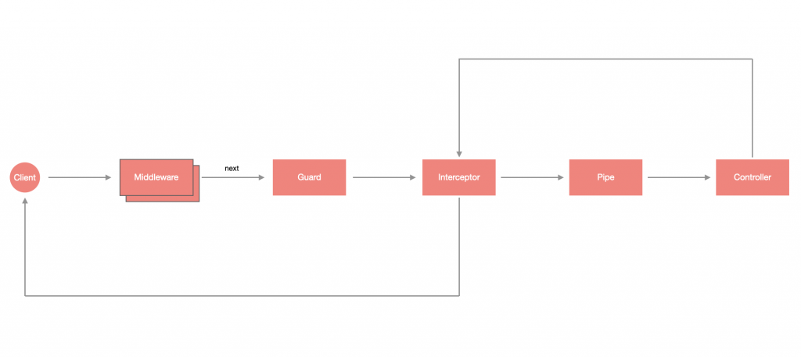

# 什么是 Guard？

守卫（Guard） 是一种 **检测机制**，就像公司的安保系统，需要使用门禁卡才能进入，否则就会被挡在门外。这样的机制经常用在 **身份验证与授权**，当有未经授权的请求时，将会由 Guard 拦截并挡下。在传统的 `Express` 应用程序中，通常由中间件处理授权，这样的处理方式并没有不好，只是中间件不知道调用 `next()` 函数后会执行哪个处理程序，相比之下，Nest 设计了 Guard 更能确保它的执行顺序，从下图可以看出 Guard 是执行在 `Middleware` 之后、`Interceptor` 之前：



# 创建 Guard

守卫可以通过 CLI  创建：

```shell
$ nest generate guard <GUARD_NAME>
```

> **！注意**：<GUARD_NAME> 可以含有路径，如：`common/guards/auth`，这样就会在 `src` 目录下建立该路径并含有 Guard。

这里我创建一个 `AuthGuard`：

```shell
$ nest g gu common/guards/auth
```

生成文件内容如下：

```typescript
import { CanActivate, ExecutionContext, Injectable } from '@nestjs/common';
import { Observable } from 'rxjs';

@Injectable()
export class AuthGuard implements CanActivate {
  canActivate(
    context: ExecutionContext,
  ): boolean | Promise<boolean> | Observable<boolean> {
    return true;
  }
}
```

可以看到，守卫也是带有 `@Injectable()` 装饰器的类，不过它必须实现 `CanActivate` 接口及 `canActivate(context: ExecutionContext)` 方法，该方法可以是同步或异步的，所以回传值可以是 `boolean`、`Promise<boolean>` 或 `Observable<boolean>`，如果要让验证能够通过，就必须让最终结果为 `true`。

# 使用 Guard

在使用之前，先将 `auth.guard.ts` 修改一下，刻意将结果回传 `false`，并使用异步方法：

```typescript
import { CanActivate, ExecutionContext, Injectable } from '@nestjs/common';
import { Observable, of } from 'rxjs';
import { delay } from 'rxjs/operators';

@Injectable()
export class AuthGuard implements CanActivate {
  canActivate(
    context: ExecutionContext,
  ): boolean | Promise<boolean> | Observable<boolean> {
    return of(false).pipe(delay(2000));
  }
}
```

## 局部使用

你可以在某个 **路由** 或 直接在某个 **控制器** 上通过 `@UseGuards` 使用守卫。比如：

```typescript
import { Controller, Get, UseGuards } from '@nestjs/common';
import { AppService } from './app.service';
import { AuthGuard } from './common/guards/auth.guard';

// -- 控制器使用
@UseGuards(AuthGuard)
@Controller()
export class AppController {
  constructor(private readonly appService: AppService) {}
  // -- 单个路由使用
  @UseGuards(AuthGuard)
  @Get('/todos')
  async getTodos() {
    return await this.appService.getTodos();
  }
  @Get()
  getHello() {
    return this.appService.hello();
  }
}
```

## 全局使用

### eg1：app.useGlobalGuards

```typescript
import { NestFactory } from '@nestjs/core';
import { AppModule } from './app.module';
import { AuthGuard } from './common/guards/auth.guard';
async function bootstrap() {
  const app = await NestFactory.create(AppModule);
  app.useGlobalGuards(new AuthGuard());
  await app.listen(3000);
}
bootstrap();
```

### eg2：依赖注入

```typescript
import { Module } from '@nestjs/common';
import { APP_GUARD } from '@nestjs/core';
import { AppController } from './app.controller';
import { AppService } from './app.service';
import { AuthGuard } from './common/guards/auth.guard';

@Module({
  controllers: [AppController],
  providers: [AppService, { provide: APP_GUARD, useClass: AuthGuard }],
})
export class AppModule {}
```

# 小结

守卫是实现授权和身份验证的好帮手，也是非常常用的功能，后面在讲解关于守卫的示例。

1. 守卫在中间件之后，拦截器之前执行
2. 守卫比中间件更适合做授权和身份验证
3. 善于通过 `ExecutionContext` 获取雁阵该相关信息
4. 全局使用可通过依赖注入的形式实现
