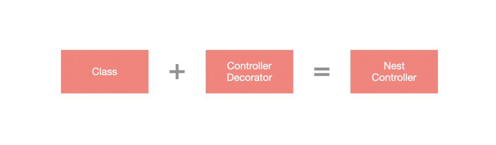

# 概述

装饰器（Decorator）是一种设计模式，有些编程语言会直接将此设计模式实现出来，TypeScript 与 JavaScript 在近年也添加了此功能，而 Nest 将装饰器发挥到淋漓尽致，通过装饰器就可以很轻易地套用功能，不论是针对开发速度、易读性等都很有帮助。

`ES2016` 装饰器是一个表达式，它返回一个可以将目标、名称和属性描述符作为参数的函数。通过在装饰器前面添加一个 `@` 字符并将其放置在你要装饰的内容的最顶部来应用它。可以为类、方法或属性定义装饰器。

如果你对装饰器的概念还不是特别了解，建议先阅读 [这里 >>](https://medium.com/google-developers/exploring-es7-decorators-76ecb65fb841)



# 自定义装饰器

Nest 提供许多装饰器，但在某些情况下内建的装饰器可能没办法很有效地解决问题，于是 Nest 提供了 自订装饰器 (Custom Decorator) 的功能，其分成下方三种：

## 参数装饰器

有些数据可能无法通过内置的装饰器直接取得，比如：授权认证机制所带入的数据。如果对 Express 不陌生的话应该看过下方的写法，为什麽会有自定义的数据放在请求对象中呢？主要是在使用授权认证机制时（如 `jwt`），会将认证信息放在请求对象中，如下所示：

```typescript
const user = req.user;
```

可以试想一下，如果要通过内置装饰器要如何取得该数据？必需要使用 `@Request` 装饰器先取得请求对象，再从请求对象中提取，这样的方式并不是特别理想，于是可以自行设计参数装饰器来取得，而 Decorator 可以通过 CLI 生成：

```shell
$ nest generate decorator <DECORATOR_NAME>
```

> **！注意**：<DECORATOR_NAME> 可以含有路径，如：core/decorators/user，这样就会在 `src` 目录下建立该路径并含有 Decorator。

这里我创建了一个 `User` 装饰器：

```shell
$ nest g d core/decorators/user 
```

生成的文件内容为：

```typescript
import { SetMetadata } from '@nestjs/common';

export const User = (...args: string[]) => SetMetadata('user', args);
```

不过参数装饰器并不是使用 `SetMetadata`，而是使用 `createParamDecorator`，通过 `createParamDecorator` 来生成参数装饰器，并使用 `Callback` 裡面的 `ExecutionContext` 来取得请求对象再从中取得要取出的数据。下方为修改后的 `user.decorator.ts`：

```typescript
import { createParamDecorator, ExecutionContext } from '@nestjs/common';

export const User = createParamDecorator(
  (data: unknown, ctx: ExecutionContext) => {
    const request = ctx.switchToHttp().getRequest();
    return request.user;
  },
);
```

接下来我们设计一个中间件将 `user` 添加到请求对象中，首先我们通过 CLI 创建一个中间件：

```shell
$ nest g mi core/middlewares/add-user
```

修改 `add-user.middleware.ts` 内容：

```typescript
import { Injectable, NestMiddleware } from '@nestjs/common';

@Injectable()
export class AddUserMiddleware implements NestMiddleware {
  use(req: any, res: any, next: () => void) {
    req.user = { name: '耀哥' };
    next();
  }
}
```

接下来我们在 `AppModule` 中使用该中间件：

```typescript
import { MiddlewareConsumer, Module, NestModule } from '@nestjs/common';
import { AppController } from './app.controller';
import { AppService } from './app.service';
import { AddUserMiddleware } from './core/middlewares/add-user.middleware';
@Module({
  controllers: [AppController],
  providers: [AppService],
})
export class AppModule implements NestModule {
  configure(consumer: MiddlewareConsumer) {
    consumer.apply(AddUserMiddleware).forRoutes('');
  }
}
```

这样就能够将 `user` 添加到请求对象里了。接下来就要使用 `User` 装饰器来将 `user` 内容取出并返回给客户端，这里我们修改 `app.controller.ts`：

```typescript
import { Controller, Get } from '@nestjs/common';
import { User } from './core/decorators/user.decorator';

@Controller()
export class AppController {
  constructor() {}

  @Get()
  getHello(@User() user: any): string {
    return user;
  }
}
```

浏览器查看 http://localhost:3000 会看到下方结果，表示有成功将 `user` 取出：

```json
{"name":"耀哥"}
```

那如果想要像 `@Param('id')` 一样只取出特定数据的话该如何设计呢？`createParamDecorator` 中的 `Callback` 里面除了 `ExecutionContext` 之外，还有一个 `data`，这个 `data` 事实上就是带到装饰器中的参数，所以要运用 `data` 来取出 `user` 中的数据。这裡修改一下 `user.decorator.ts`：

```typescript
import { createParamDecorator, ExecutionContext } from '@nestjs/common';

export const User = createParamDecorator(
  (data: string, ctx: ExecutionContext) => {
    const request = ctx.switchToHttp().getRequest();
    const user = request.user;
    return data ? user[data] : user;
  },
);
```

修改 `app.controller.ts` 來指定取出 `user` 中的 `name`：

```typescript
import { Controller, Get } from '@nestjs/common';
import { User } from './core/decorators/user.decorator';

@Controller()
export class AppController {
  constructor() {}

  @Get()
  getHello(@User('name') name: string): string {
    return name;
  }
}
```

浏览器查看 http://localhost:3000 会看到下方结果：

```
耀哥
```

## 元数据装饰器

有时候需要针对某个方法设置特定的 `Metadata`，比如：角色权限控制，通过设置 `Metadata` 来表示该方法仅能由特定角色来存取。这里来实现一个简单的角色权限控制功能，通过 CLI 产生 Roles：

```shell
$ nest g d core/decorators/roles
```

默认生成的代码就是自定义 `Metadata` 装饰器的格式，`SetMetadata` 即生成自定义 `Metadata` 的装饰器：

```typescript
import { SetMetadata } from '@nestjs/common';

export const Roles = (...args: string[]) => SetMetadata('roles', args);
```

这个范例的意思为：`Roles` 即为装饰器名称，通过 `@Roles('admin')` 将 `admin` 字串带入装饰器中，`SetMetadata` 指定 `roles` 为 key 值，并令 `['admin']` 为其值，最后设置为 `Metadata`。

接下来，我们创建一个 `RoleGuard` 模拟角色权限管理的效果：

```shell
$ nest g gu core/guards/role
```

Nest 提供的 `Reflector` 来获取 `Metadata` 的内容，通过依赖注入的形式引入 `Reflector` ，并通过 `get` 方法来获取 `metadata`：

```typescript
get(metadataKey: any, target: Function | Type<any>)
```

- `metadataKey`：要查询的 key 值
- `target `：装饰器装饰的目标，经常会使用 `ExecutionContext` 里面的 `getHandler` 来作为 `target` 的值。

将 `role.guard.ts` 的内容修改如下：

```typescript
import { CanActivate, ExecutionContext, Injectable } from '@nestjs/common';
import { Reflector } from '@nestjs/core';
import { Observable } from 'rxjs';

@Injectable()
export class RoleGuard implements CanActivate {
  // -- 注入Reflector
  constructor(private readonly reflector: Reflector) {}

  canActivate(
    context: ExecutionContext,
  ): boolean | Promise<boolean> | Observable<boolean> {
    // -- 获取metadata数据
    const roles = this.reflector.get<string[]>('roles', context.getHandler());
    // -- 获取请求对象
    const request = context.switchToHttp().getRequest();
    // -- 拿到用户数据
    const user = request.user;
    // -- 自定义校验逻辑，判断用户权限
    return this.matchRoles(roles, user.roles);
  }

  private matchRoles(resources: string[], target: string[]): boolean {
    return !!resources.find((x) => target.find((y) => y === x));
  }
}
```

在设置好 `Roles` 与 `RoleGuard` 之后，就来调整一下 `AddUserMiddleware` 的内容，添加角色 `staff` 到 `user` 里面：

```typescript
import { Injectable, NestMiddleware } from '@nestjs/common';

@Injectable()
export class AddUserMiddleware implements NestMiddleware {
  use(req: any, res: any, next: () => void) {
    req.user = { name: '耀哥', roles: ['staff'] };
    next();
  }
}
```

最后，调整一下 `app.controller.ts` 的内容，指定 `getHello` 只有 `admin` 身份可以存取：

```typescript
import { Controller, Get, UseGuards } from '@nestjs/common';
import { Roles } from './core/decorators/roles.decorator';
import { User } from './core/decorators/user.decorator';
import { RoleGuard } from './core/guards/role.guard';

@Controller()
export class AppController {
  constructor() {}

  @UseGuards(RoleGuard)
  @Roles('admin')
  @Get()
  getHello(@User('name') name: string): string {
    return name;
  }
}
```

浏览器查看 http://localhost:3000 会发现没有权限调用，返回如下信息：

```json
{"statusCode":403,"message":"Forbidden resource","error":"Forbidden"}
```

## 整合装饰器

有些装饰器它们之间是有关联的，比如：授权验证需要使用 `Guard`、添加自定义 `Metadata` 等，每次在需要用到的地方都要重複将这些装饰器带入，会使得重複性的操作变多，于是 Nest 设计了 `applyDecorators`函数来将多个装饰器整合成一个装饰器，每当要实现该功能时就只要带入整合装饰器即可。下方会简单模拟授权验证的整合装饰器，先通过 CLI 产生 `Auth Decorator`：

```shell
$ nest g d core/decorators/auth
```

接著，`Auth` 需包含 `UseGuards`、`Roles` 这两个装饰器的功能，在设计整合装饰器之前需要先透过 CLI 产生 `AuthGuard` 以便后续使用：

```shell
$ nest g gu core/guards/auth
```

> **！注意**：本节主要是将焦点放在整合功能上，所以这裡就不特别去改 `AuthGuard` 的内容了，让它们回传 `true` 即可。如果你刚刚已创建这里可不用创建。

创建 `AuthGuard` 之后，接下来修改一下 `auth.decorator.ts` 的内容，通过 `applyDecorators` 将 `UseGuards`、`Roles` 整合成一个装饰器：

```typescript
import { applyDecorators, UseGuards } from '@nestjs/common';
import { RoleGuard } from '../guards/role.guard';
import { AuthGuard } from '../guards/auth.guard';
import { Roles } from './roles.decorator';

export const Auth = (...roles: string[]) =>
  applyDecorators(Roles(...roles), UseGuards(AuthGuard, RoleGuard));
```

最后来调整一下 `app.controller.ts`，套用 `Auth` 装饰器并指定 `getHello` 只有 `staff` 可以存取：

```typescript
import { Controller, Get } from '@nestjs/common';
import { Auth } from './core/decorators/auth.decorator';
import { User } from './core/decorators/user.decorator';

@Controller()
export class AppController {
  constructor() {}

  @Auth('staff')
  @Get()
  getHello(@User('name') name: string): string {
    return name;
  }
}
```

浏览器查看 http://localhost:3000 会看到下方结果：

```
耀哥
```

# 小结

自定义装饰器可以补足 Nest 内建装饰器不足的部分，且具有相当大的弹性，是非常实用的功能。

- 自定义装饰器可实现：**参数装饰器**、**自订 Metadata 装饰器**、**整合装饰器**。
- 参数装饰器是使用 `createParamDecorator` 来产生。
- 自订 `Metadata` 装饰器可以说是 `SetMetadata` 的扩展。
- 整合装饰器是使用 `applyDecorators` 来产生。

到这里，你已经掌握了 Nest 基础部分，从下一篇章节开始，我们即将进入进阶课程。