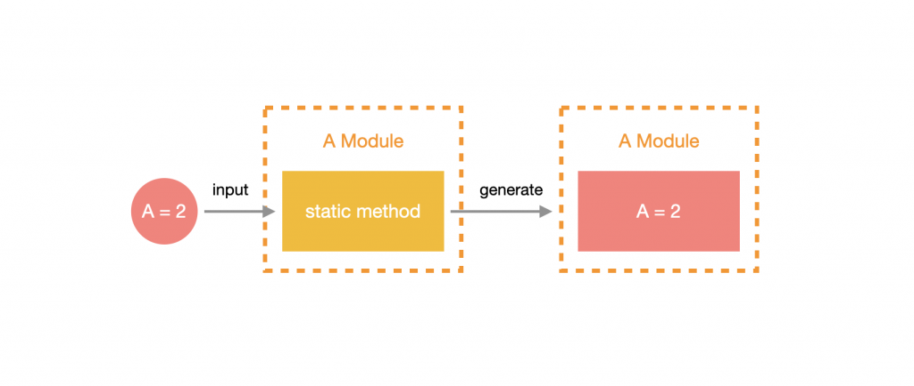

# 概述

前面有介绍过 模块 的一些基本使用方式，然而有一项非常强大的功能没有被提及，就是 **动态模块(Dynamic Module)**，它可以用很简单的方式去 **定制化提供者（Provider）的内容**，使该模块的 Provider 动态化。什么意思呢？简单来说，就是我们希望这个模块是可以通过外部传入参数去设置 Provider 的内容的。

与一般 **静态模块(Static Module)** 不同的地方在于，静态模块创建后 Provider就创建完毕了，如果要更改 Provider 相关配置则需要修改这个模块内部的代码；动态模块则是将可能会变动的部分 **参数化**，让使用者在使用这个模块时，可以通过其提供的 **静态方法** 来带入参数，让 Provider 接受该参数并建立模块。



用生活中的例子来说明的话，静态模块就像一个专用遥控器，在没有去改写内部的规则之前，它只能针对特定设备做控制；动态模块就像一个万能遥控器，同样是控制设备，但只需要根据特定的操作就能去控制不同的设备。

# 构建动态模块

动态模块非常常用，比如配置模块，它会根据你传入的文件路径来加载不同的配置文件。可以让我们轻松的配置不同环境的数据。

本节内容我们会运用 **动态模块** 与 [dotenv](https://www.npmjs.com/package/dotenv) 来实现一套简单的环境变量管理模块：`ConfigModule`

> **！提示**：关于配置（环境变量）的详细介绍，请阅读下一章节

话不多说，直接开始吧。首先安装依赖：

```shell
$ npm install dotenv --save
```

然后通过 CLI 生成 `ConfigModule ` 和 `ConfigService`：

```shell
$ nest g mo config
$ nest g s  config
```

接着打开 `config.module.ts`， 添加一个 `register` 静态方法，返回具有 `DynamicModule` 接口的对象，这个对象与 `@Module` 装饰器内的参数大致相同，不同的是必须要带上 `module` 参数，其值为 `ConfigModule` 本身，另外， `global` 参数可以使注册的 `Module` 变成全局的：

```typescript
import { DynamicModule, Module } from '@nestjs/common';
import { ConfigService } from './config.service';

@Module({})
export class ConfigModule {
  static register(): DynamicModule {
    return {
      providers: [ConfigService],
      module: ConfigModule,
      global: true
    };
  }
}
```

> **！注意**：静态方法可以自行设计，但返回值必须是 `DynamicModule`，名称通常会使用 `forRoot` 或 `register`。

从上方代码可以看出 `@Module({})` 的参数清空了，这是为什麽呢？因为我们只使用动态模块，所以没有特别设计静态模块的部分，但如果要设计也是可以的。

接下来为 `register` 方法设计参数：`options`，然后用 **值提供者** 的方式将该值记录下来。先创建 *`config/constants/token.const.js`* 文件，然后填入如下内容：

```typescript
export const CONFIG_OPTIONS = 'CONFIG_OPTIONS';
```

这个文件的主要作用就是管理我们在使用值提供者时所需要的 token。

调整 `config.module.ts`：

```typescript
import { DynamicModule, Module } from '@nestjs/common';
import { ConfigService } from './config.service';
import { CONFIG_OPTIONS } from './constants/token.const';

@Module({})
export class ConfigModule {
  static register(options: { path: string }): DynamicModule {
    return {
      providers: [
        {
          provide: CONFIG_OPTIONS,
          useValue: options,
        },
        ConfigService,
      ],
      exports: [ConfigService],
      module: ConfigModule,
      global: true,
    };
  }
}
```

最后就是设计 `ConfigService` 的内容了，在 `constructor` 注入刚刚记录的 `options`，然后读取 `.env` 文档并写入 `config` 属性中，最后设计一个 `get(key: string)` 的方法来提取要用的环境变量：

```typescript
import { Inject, Injectable } from '@nestjs/common';

import * as fs from 'fs';
import * as path from 'path';
import * as dotenv from 'dotenv';

import { CONFIG_OPTIONS } from './constants/token.const';

@Injectable()
export class ConfigService {
  private config: any;

  constructor(
    @Inject(CONFIG_OPTIONS) private readonly options: { path: string },
  ) {
    const filePath = path.resolve(__dirname, '../', options.path);
    this.config = dotenv.parse(fs.readFileSync(filePath));
    console.log(this.config);
  }

  public get(key: string): string {
    return this.config[key];
  }
}
```

# 使用动态模块

首先在 **根目录** 下新建 `.env.development` 文件，并添加内容：

```
USERNAME=Li-HONGYAO
```

接着，调整 `app.module.ts` 的內容：

```typescript
import { Module } from '@nestjs/common';
import { AppController } from './app.controller';
import { AppService } from './app.service';
import { ConfigModule } from './config/config.module';

@Module({
  imports: [
    ConfigModule.register({
      path: `../.env.${process.env.NODE_ENV || 'development'}`,
    }),
  ],
  controllers: [AppController],
  providers: [AppService],
})
export class AppModule {}
```

调整 `app.controller.ts` 的內容，注入 `ConfigurationService`，并改写 `getHello` 返回值：

```typescript
import { Controller, Get } from '@nestjs/common';
import { ConfigService } from './config/config.service';

@Controller()
export class AppController {
  constructor(private readonly configService: ConfigService) {}

  @Get()
  getHello() {
    return this.configService.get('USERNAME');
  }
}
```

浏览器查看 http://localhost:3000 ，返回如下信息：

```json
"Li-HONGYAO"
```

> **！提示**：关于动态模块的官方示例，请参考 [这里 >>](https://github.com/nestjs/nest/tree/master/sample/25-dynamic-modules)

# 小结

动态模块是非常好用且实用的功能，经常运用在资料库、环境变量管理等功能，不过需要对 Nest 的依赖注入机制有一定程度的了解，在基础稳固之后学习上比较不会有问题。

- 动态模块是运用静态方法回传一个 `DynamicModule` 型别的物件。
- 善用 动态模块 来抽离共用元件。
- 动态模块 必须包含 `module` 参数。
- 静态方法名称通常取为 `forRoot` 或 `register`。


