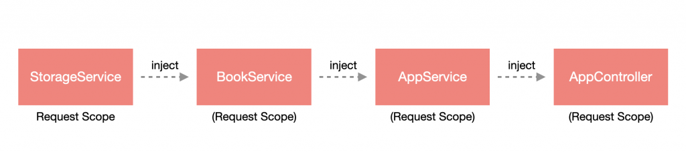
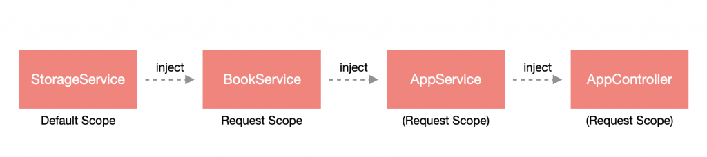

# 概述

Nest 在大多数情况下是采用 **单例模式 (Singleton pattern)** 来维护各个实例的，也就是说，各个进来的请求都共享相同的实例，这些实例会维持到 Nest App 结束为止。但有些情况可能就需要针对各个请求做处理，这时候可以通过调整 **注入作用域 (Injection scope)** 来决定实例的创建时机。

> **！注意**：虽然说可以调整创建实例时机，但如果非必要还是建议采用单例模式，原因是可以提升系统整体性能，若针对每个请求建立实例，将会花费更多资源在处理建立与垃圾回收上。

# 作用域

Nest 共有三种作用域可以使用：

- **默认作用域 (Default scope)**：即单例模式的作用域。
- **请求作用域 (Request scope)**：为每个请求建立全新的实例，在该请求中的 提供者 是共享实例的，请求结束后将会进行垃圾回收。
- **独立作用域 (Transient scope)**：每个 提供者 都是独立的实例，在各 提供者 之间不共享。

## Provider 设置作用域

Provider 设定作用域只需要在 `@Injectable` 装饰器中做配置即可，它有提供一个可选参数，通过填入 `scope` 来做指定，而作用域参数可以通过 Nest 提供的 `enum - Scope` 来配置。以 `app.service.ts` 为例：

```typescript
import { Injectable, Scope } from '@nestjs/common';

@Injectable({ scope: Scope.REQUEST })
export class AppService {

  getHello(): string {
    return 'Hello World!';
  }

}
```

如果是自定义 Provider 的话，就多一个 `scope` 的属性。以 `app.module.ts` 为例：

```typescript
import { Module, Scope } from '@nestjs/common';
import { AppController } from './app.controller';
import { AppService } from './app.service';

@Module({
  imports: [],
  controllers: [AppController],
  providers: [
    AppService,
    {
      provide: 'USERNAME',
      useValue: 'Li-HONGYAO',
      scope: Scope.REQUEST, // 添加 scope 屬性
    },
  ],
})
export class AppModule {}
```

## Controller 设置作用域

Controller 设定作用域只要调整 `@Controller` 装饰器的参数即可，同样使用可选参数来配置，若有路由设定，将其配置在 `path` 属性，而作用域则是 `scope`。以 `app.controller.ts` 为例：

```typescript
import { Controller, Get, Scope } from '@nestjs/common';
import { AppService } from './app.service';

@Controller({ scope: Scope.REQUEST })
export class AppController {
  constructor(private readonly appService: AppService) {}

  @Get()
  getHello() {
    return this.appService.getHello();
  }
}
```

## 作用域冒泡

作用域的配置会影响整个注入链作用域范围，什麽意思呢？这裡用下方图示作为示例：


可以看到 `StorageService` 分别在 `AppModule` 与 `BookModule` 被使用，而 `BookService` 又在 `AppModule` 被使用，此时，如果我们把 `StorageService` 的作用域设置为“请求作用域”，那麽依赖于 `StorageService` 的 `BookService` 与 `AppService` 都会变成请求作用域，所以按这样的逻辑来看，`AppController` 也会变成请求作用域，因为它依赖了 `AppService`：



但如果是把 `BookService` 设为“请求作用域”，那就仅有 `AppService` 与 `AppController` 会是请求作用域，因为 `StorageService` 不依赖于 `BookService`：



## 请求作用域与请求对象

由于请求作用域是针对每一个请求来建立实例，所以能通过注入 `REQUEST` 来取得请求对象。以 `app.service.ts` 为例：

```typescript
import { Inject, Injectable, Scope } from '@nestjs/common';
import { REQUEST } from '@nestjs/core';

import { Request } from 'express';

@Injectable({ scope: Scope.REQUEST })
export class AppService {
  constructor(@Inject(REQUEST) private readonly request: Request) {}

  getHello(): string {
    return 'Hello World!';
  }
}
```

做个简单的实验，来验证各个作用域的实例化时间与实例的共享，会使用上面 `AppModule`、`BookModule` 与 `StorageModule` 的架构。首先，先来建立 `StorageModule` 与 `BookModule`：

```shell
$ nest g mo shared/storage
$ nest g s  shared/storage
$ nest g mo shared/book
$ nest g s  shared/book
```

接著，设计一下 `storage.service.ts` 的内容，在 `contructor` 印出含有乱数的字串，透过乱数可以让我们清楚知道该实例是否为同一个实例，也可以运用这样的方式观察建立实例的时机，然后设计一套添加资料与取得资料的方法：

```typescript
import { Injectable } from '@nestjs/common';

@Injectable()
export class StorageService {
  constructor() {
    console.log(`Storage: ${Math.random()}`);
  }

  private list: any[] = [];

  public getItems(): any[] {
    return this.list;
  }

  public addItem(item: any): void {
    this.list.push(item);
  }
}
```

调整 `storage.module.ts` 的内容，将 `StorageService` 汇出：

```typescript
import { Module } from '@nestjs/common';
import { StorageService } from './storage.service';

@Module({
  providers: [StorageService],
  exports: [StorageService],
})
export class StorageModule {}s
```

再来我们设计一下 book.service.ts 的内容，将 StorageService 注入并设计一套存取资料的方法，同样在 constructor 印出含有乱数的字串：

```typescript
import { Injectable } from '@nestjs/common';
import { StorageService } from '../storage/storage.service';

@Injectable()
export class BookService {
  constructor(private readonly storage: StorageService) {
    console.log(`Book: ${Math.random()}`);
  }

  public getBooks(): any[] {
    return this.storage.getItems();
  }

  public addBook(book: any): void {
    this.storage.addItem(book);
  }
}
```

因为有用到 StorageService，故要引入 StorageModule，这边我们修改一下 book.module.ts，并将 BookService 汇出：

```typescript
import { Module } from '@nestjs/common';
import { StorageModule } from '../storage/storage.module';
import { BookService } from './book.service';

@Module({
  imports: [StorageModule],
  providers: [BookService],
  exports: [BookService],
})
export class BookModule {}
```

最后就是调整 app.service.ts 与 app.controller.ts 了，这裡我们先改一下 app.service.ts 的内容，将 BookService 与 StorageService 注入，并为它们各设计一套存取方法，然后也在 constructor 印出含有乱数之字串：

```typescript
import { Injectable } from '@nestjs/common';
import { BookService } from './shared/book/book.service';
import { StorageService } from './shared/storage/storage.service';

@Injectable()
export class AppService {
  constructor(
    private readonly bookService: BookService,
    private readonly storage: StorageService,
  ) {
    console.log(`AppService: ${Math.random()}`);
  }

  public addBookToStorage(book: any): void {
    this.storage.addItem(book);
  }

  public addBookToBookStorage(book: any): void {
    this.bookService.addBook(book);
  }

  public getStorageList(): any[] {
    return this.storage.getItems();
  }

  public getBookList(): any[] {
    return this.bookService.getBooks();
  }
}

```

修改 app.controller.ts，在 constructor 透过 AppService 去呼叫 BookService 与 StorageService 的存入方法，并设计一个 /compare 的路由来看看是否存取相同的 StorageService 实例：

```typescript
import { Controller, Get } from '@nestjs/common';
import { AppService } from './app.service';

@Controller()
export class AppController {
  constructor(private readonly appService: AppService) {
    this.appService.addBookToStorage({ name: 'Nest Tutorial' });
    this.appService.addBookToBookStorage({ name: 'Angular Tutorial' });
    console.log(`AppController: ${Math.random()}`);
  }

  @Get('/compare')
  getCompare() {
    return {
      storage: this.appService.getStorageList(),
      books: this.appService.getBookList(),
    };
  }
}
```

## 默认作用域

预设作用域不需要特别指定，所以我们直接启动 Nest App 即可，启动后会在终端机看到下方的讯息：

```
Storage: 0.5154167235100049
Book: 0.003178436868019663
AppService: 0.19088741578100654
AppController: 0.70972377329212
```

这代表什麽呢？因为是单例模式，在 Nest 建立的时候所有的依赖项目都会被建立起来，并持续到 Nest 关闭为止，所以我们才会在启动时就看见这些字串，并且不会再看见它们，直到下次重新启动。

透过浏览器查看 http://localhost:3000/compare，会发现与我们预期是相同的，BookModule 与 AppModule 会共用同一个 StorageService，所以才会回传两个一模一样的资料：

```
{"storage":[{"name":"Nest Tutorial"}],"books":[{"name":"Angular Tutorial"}]}
```

## 请求作用域

我们将请求作用域配置在 BookService 上，所以理论上 StorageService 会是单例的，而 BookService、AppService 与 AppController 会是请求作用域。这裡修改一下 book.service.ts：

```typescript
import { Injectable, Scope } from '@nestjs/common';
import { StorageService } from '../storage/storage.service';

@Injectable({ scope: Scope.REQUEST })
export class BookService {
  constructor(private readonly storage: StorageService) {
    console.log(`Book: ${Math.random()}`);
  }

  public getBooks(): any[] {
    return this.storage.getItems();
  }

  public addBook(book: any): void {
    this.storage.addItem(book);
  }
}
```

接著重新啟動 Nest App，會在終端機看到下方訊息：

```
Storage: 0.68586411156073
```

为什麽只有看到 StorageService 印出来的资讯呢？原因是 StorageService 保持在单例模式，所以在启动时就会被建立，但 BookService 是请求作用域，当有请求进来的时候才会被实例化，所以才会没有显示出来。

透过浏览器查看 http://localhost:3000/compare，会发现与预期结果相同，在终端机上会看到下方讯息：

```
Book: 0.6108029647317379
AppService: 0.45408412349620186
AppController: 0.5903841849655078
```

然后浏览器上显示的结果与预设作用域相同，不过如果这时候按下重新整理的话，会发现资料变多了，原因是我们只要在 AppController 实例化的时候就添加资讯，所以才会增加资料到 StorageService：

```
{"storage":[{"name":"Nest Tutorial"},{"name":"Nest Tutorial"}],"books":[{"name":"Angular Tutorial"},{"name":"Angular Tutorial"}]}s
```

## 独立作用域

这部分我们改成将 StorageService 设置成独立作用域，所以将 BookService 的 scope 移除，并修改 storage.service.ts：

```typescript
import { Injectable, Scope } from '@nestjs/common';

@Injectable({ scope: Scope.TRANSIENT })
export class StorageService {
  constructor() {
    console.log(`Storage: ${Math.random()}`);
  }

  private list: any[] = [];

  public getItems(): any[] {
    return this.list;
  }

  public addItem(item: any): void {
    this.list.push(item);
  }
}
```

重新启动 Nest App，会在终端机看到以下讯息：

```
Storage: 0.0831149236434856
Storage: 0.4770995488008587    
Book: 0.6859440510125339       
AppService: 0.22239040459644244
AppController: 0.494136680403942
```

会发现 StorageService 建立了两个实例，原因是独立作用域在各个 Provider 之间是不共享实例的，而 StorageService 在 BookService 与 AppService 各建立了一次，所以会有两个实例。

透过浏览器查看 http://localhost:3000/compare，会发现两者资料不一致，这与我们预期是相同的，因为它们是不同的实例：

```
{"storage":[{"name":"Nest Tutorial"}],"books":[{"name":"Angular Tutorial"}]}s
```

# 小结

在一般情况下其实不太会去变动注入作用域的范围，但在某些特定情况下是必要的，虽然说不太会变动，但我认为这篇的内容可以对 Nest 的依赖注入规则有更进一步的理解

- Nest 预设採用单例模式维护实例。
- 透过改变注入作用域的范围来改变实例的维护规则。
- 共有三个作用域规则：预设作用域、请求作用域、独立作用域。
- 预设作用域即单例模式。
- 请求作用域会针对各个请求建立实例。
- 独立作用域会使各 Provider 之间不共享。
- 请求作用域可以透过注入 REQUEST 来取得请求物件。