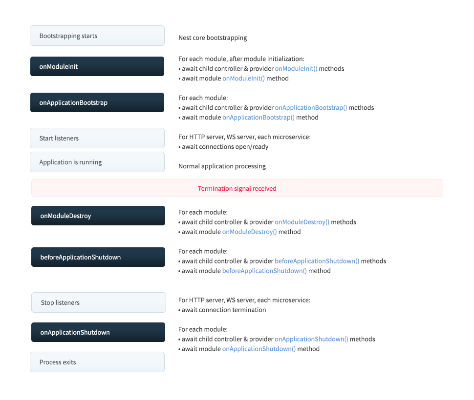

# 概述

所有应用程序元素都有一个由 `Nest` 管理的生命周期。`Nest` 提供了**生命周期钩子**，提供了对关键生命时刻的可见性，以及在关键时刻发生时采取行动(在你的`module`，`injectable`或者`controller`中注册代码)的能力。

# 生命周期序列

下图描述了关键应用生命周期事件序列，从应用引导之时到node应用退出。我们可以把整个生命周期划分为三个阶段：初始化，运行和终止。使用生命周期，你可以合理计划模块和服务的初始化，管理活动链接，并且在应用程序收到终止指令时优雅地退出。



# 生命周期事件

生命周期事件在应用初始化与终止时发生。Nest在`modules`，`injectables`和`controllers`的以下每个生命周期事件(首先要使能shutdown钩子，如下描述)中调用注册钩子方法。和上图所示的一样，Nest也调用合适的底层方法来监听连接，以及终止监听连接。

在下述表格中，`onModuleDestroy`, `beforeApplicationShutdown`和 `onApplicationShutdown`仅仅在显式调用`app.close()`或者应用收到特定系统信号(例如 SIGTERM)并且在初始化时(参见下表的应用`shutdown`部分)正确调用了`enableShutdownHooks`方法后被触发。

| 生命周期钩子方法              | 生命周期时间触发钩子方法调用                                 |
| :---------------------------- | :----------------------------------------------------------- |
| `OnModuleInit()`              | 初始化主模块依赖处理后调用一次                               |
| `OnApplicationBootstrap()`    | 在应用程序完全启动并监听连接后调用一次                       |
| `OnModuleDestroy()`           | 收到终止信号(例如SIGTERM)后调用                              |
| `beforeApplicationShutdown()` | 在`onModuleDestroy()`完成(Promise被resolved或者rejected)；一旦完成，将关闭所有连接(调用app.close() 方法). |
| `OnApplicationShutdown()`     | 连接关闭处理时调用(app.close())                              |

> **！注意**：上述列出的生命周期钩子没有被请求范围类触发。请求范围类并没有和生命周期以及不可预测的寿命绑定。他们为每个请求单独创建，并在响应发送后通过垃圾清理系统自动清理。

# 使用

所有应用周期的钩子都有接口表示，接口在技术上是可选的，因为它们在 `TypeScript` 编译之后就不存在了。尽管如此，为了从强类型和编辑器工具中获益，使用它们是一个很好的实践。要使用合适的接口。例如，要注册一个方法在特定类(例如，控制器，提供者或者模块)初始化时调用，使用`OnModuleInit`接口，提供`onModuleInit()`方法，如下：

```typescript
import { Injectable, OnModuleInit } from '@nestjs/common';

@Injectable()
export class UsersService implements OnModuleInit {
  onModuleInit() {
    console.log(`The module has been initialized.`);
  }
}

```